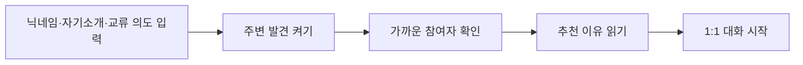
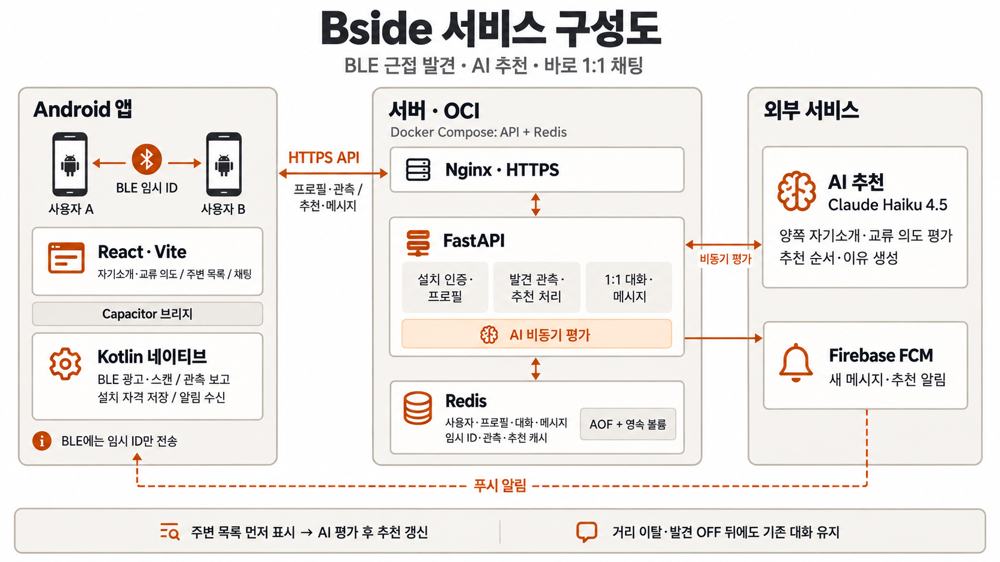

# Bside

**가까이 있는 사람과, 대화할 이유를 찾다.**

Bside는 같은 공간에 있는 사람 중 **지금 나와 이야기를 나눌 만한 상대를 발견하고, 첫 대화를 시작하도록 돕는 서비스**입니다. Bluetooth로 주변 참여자를 찾고, AI가 서로의 자기소개와 만나고 싶은 사람을 읽어 추천 이유를 알려줍니다. 마음이 가는 상대에게 바로 1:1 메시지를 보낼 수 있습니다.

코쓱톤 2026 · 주제 **교류** · **3조 Clauding** · Android MVP

[사용 흐름](#사용-흐름) · [AI 추천](#ai가-찾는-대화의-접점) · [수익 모델](#수익-모델과-초기-시장) · [구현 및 검증](#구현-및-검증) · [실행하기](#실행하기)

## 같은 공간에 있어도, 서로를 알기는 어렵습니다

해커톤에서 팀원을 찾을 때, 밋업에서 경험을 나누고 싶을 때, 대학 라운지에서 막힌 과제를 물어보고 싶을 때가 있습니다. 주변에 사람이 있어도 누가 어떤 경험을 갖고 있고, 지금 어떤 이야기를 원하는지 바로 알기는 어렵습니다.

Bside가 풀고자 하는 문제는 **대화 상대를 찾고 말을 걸기까지의 정보 부족**입니다.

| 교류를 가로막는 순간 | Bside의 해결 방식 | 기대하는 변화 |
| --- | --- | --- |
| 누가 지금 가까이 있는지 모릅니다 | BLE로 주변에서 발견 참여를 켠 사람을 보여줍니다 | 같은 공간의 교류 상대를 찾습니다 |
| 자기소개만으로는 오늘 무슨 이야기를 원하는지 모릅니다 | 자기소개와 현재의 교류 의도를 따로 입력합니다 | 지금 나눌 수 있는 이야기를 파악합니다 |
| 누구에게 어떤 이유로 말을 걸어야 할지 망설입니다 | 양쪽 의도를 고려한 추천 이유와 바로 시작하는 채팅을 제공합니다 | 첫 메시지를 보낼 구체적인 계기를 얻습니다 |

해커톤의 [‘교류’라는 주제](docs/hackathon-brief.md)를 **발견 → 서로에 대한 이해 → 첫 대화 → 이어지는 관계**로 풀었습니다. 행사는 이 흐름을 함께 경험하기 좋은 첫 사용처이며, 대학·공유 오피스처럼 사람들이 함께 머무는 공간으로도 확장할 수 있습니다.

## 사용 흐름



1. **지금의 나를 소개합니다.** 회원가입 없이 닉네임, 자기소개, 어떤 사람을 만나고 싶은지 적습니다.
2. **주변 발견을 켭니다.** BLE가 같은 앱에서 발견 참여를 켠 사람을 찾습니다. 행사 방 개설이나 QR 입장 없이 시작할 수 있습니다.
3. **대화할 상대를 살펴봅니다.** 발견된 참여자 전체를 보여주고, AI 평가가 끝나면 추천 순서와 이유를 갱신합니다. 적합한 새 상대는 추천 알림으로도 안내합니다.
4. **첫 메시지를 보냅니다.** 상대의 소개와 추천 이유를 읽고 별도 수락 절차 없이 1:1 대화를 시작합니다. 답장과 대화 지속 여부는 각자가 결정합니다.
5. **자리를 떠난 뒤에도 대화를 이어갑니다.** 멀어지거나 발견을 꺼도 이미 시작한 대화와 이력은 유지됩니다. 같은 앱 설치에서 다시 실행하면 내 정보와 대화를 복원합니다.

**사용 조건:** 양쪽 모두 Android 앱을 설치하고 Bluetooth와 인터넷을 사용할 수 있어야 합니다. 발견 참여는 직접 끌 때까지 유지되며, 실제 탐색은 권한·Bluetooth·OS 상태의 영향을 받습니다. 이번 MVP는 몇 분 이상 같은 공간에 머무는 상황을 중심으로 검증합니다.

### 이런 대화를 시작할 수 있습니다

아래는 기능을 설명하기 위한 가상 예시입니다.

| 입력 | 지우 | 민서 |
| --- | --- | --- |
| 자기소개 | 프론트엔드 개발자입니다. 개인 앱을 만들고 있고 UI 구현을 도울 수 있어요. | 백엔드 개발자입니다. 개인 서비스를 배포하고 운영해 봤어요. |
| 만나고 싶은 사람 | 첫 배포에서 막혀서, 배포 경험이 있는 분과 이야기하고 싶어요. | 사이드 프로젝트의 화면을 함께 살펴볼 프론트엔드 개발자를 만나고 싶어요. |

이 경우에는 지우의 배포 고민과 민서의 운영 경험, 민서의 화면 고민과 지우의 UI 경험이 연결점이 됩니다. 지우는 “소개에 배포 경험이 있다고 적어주셨는데, 지금 겪는 문제를 잠깐 여쭤봐도 될까요?”라고 대화를 시작할 수 있습니다.

같은 사람이라도 오늘은 배포를 물어보고, 다음에는 팀원을 찾을 수 있습니다. **지금 만나고 싶은 사람을 바꾸면 추천도 그 맥락에 맞춰 다시 평가합니다.**

## AI가 찾는 대화의 접점

교류의 목적은 자유로운 문장으로 표현됩니다. “배포에서 막혔어요”와 “서비스를 운영해 봤어요”처럼 표현과 역할이 달라도 도움이 되는 관계를 찾기 위해 AI를 사용합니다.

- **양쪽 의도를 함께 읽습니다.** 자기소개와 교류 의도를 구분하고, 공통 관심사와 서로 도울 수 있는 부분을 평가합니다. 한쪽이 원하는 교류가 상대의 의도와 충돌하면 추천 우선순위를 낮춥니다.
- **추천 이유를 설명합니다.** Claude Haiku 4.5가 연결점을 문장으로 만들고, 서버는 함께 제출된 근거 구절이 실제 입력 원문에 있는지 검사합니다. 사용자는 상세 화면에서 추천 이유를 읽을 수 있습니다.
- **사용자의 선택을 열어둡니다.** 낮은 평가나 추천 근거 부족만으로 발견된 사람을 숨기지 않습니다. AI 평가가 늦거나 실패해도 주변 목록과 대화 기능은 사용할 수 있습니다.
- **발견과 대화 권한은 서버가 확인합니다.** AI는 추천 평가와 이유 생성을 맡고, 서버가 근접 관측의 유효성·참여 상태·첫 메시지 허용 여부를 판단합니다.

의도 기반 AI 매칭은 [Brella](https://www.brella.io/) 등에서도 제공하는 접근입니다. Bside는 **사전 행사 설정 없이 가까운 사람을 발견하는 방식, 그때그때 바뀌는 교류 의도, 바로 시작하고 계속 이어가는 대화**를 하나의 경험으로 결합하는 데 집중합니다.

## 사용자에게 생기는 가치

참여자는 주변의 경험과 관심사를 살펴보고, 추천 이유를 대화의 출발점으로 삼을 수 있습니다. 짧은 네트워킹 시간에는 상대를 탐색하는 부담을 줄이고, 반복해서 만나는 공간에서는 서로 도움을 주고받을 기회를 찾도록 돕습니다.

운영자는 참가자가 실제로 대화를 시작하도록 지원해 행사·커뮤니티의 참여 경험을 높일 수 있습니다. 이 효용은 다음 지표로 검증할 계획입니다. **현재의 기기 간 동작 검증과 사용자 효용 검증은 별개입니다.**

| 검증할 가치 | 확인할 지표 |
| --- | --- |
| 첫 대화를 시작하기 쉬워지는가 | 발견 참여 후 첫 메시지까지 걸린 시간, 첫 메시지를 보낸 참여자 비율 |
| 서로에게 의미 있는 대화인가 | 첫 메시지를 받은 대화 중 답장이 오간 비율, 추천 이유의 도움 여부 |
| 실제 교류로 이어지는가 | 참여자 설문으로 확인한 대면 대화·도움 교환 여부 |
| 다음에도 사용할 이유가 있는가 | 참여자의 반복 사용, 운영자의 재도입·유료 이용 의향 |

메시지 전송만으로 대면 교류가 이루어졌다고 계산하지 않습니다. 같은 현장의 자율 네트워킹과 Bside 사용 경험을 비교해, 어느 단계에서 도움이 되는지 확인하려 합니다.

## 수익 모델과 초기 시장

**참여자의 기본 이용은 무료로 두고, 교류를 운영하는 조직에 과금하는 모델을 우선 검토합니다.** 참가자를 모으고 교류 프로그램을 운영하는 주체가 초기 도입처이자 구매자 후보입니다.

아래는 사업화 가설입니다. 유료 고객·매출·가격은 아직 검증하지 않았으며, 운영자용 기능도 후속 개발 범위입니다.

| 단계 | 구매자 후보 | 검토하는 유료 상품 | 과금 방식 |
| --- | --- | --- | --- |
| 초기 | 해커톤·밋업·부트캠프 운영자 | 참여 안내, 현장 도입 지원, 참여·대화 전환을 집계한 결과 보고 | 행사 단위 이용료 |
| 반복 도입 | 대학 사업단·창업지원단·커뮤니티 운영자 | 여러 교류 프로그램의 운영 지원과 회차별 성과 비교 | 학기·연간 계약 |
| 확장 | 공유 오피스·사내 커뮤니티 운영 조직 | 상시 교류 프로그램, 신규 구성원 연결, 운영 현황 | 공간·조직 단위 구독 |

구매자가 지불할 이유는 **참여자들이 대화를 시작하도록 돕는 운영 부담을 줄이고, 프로그램의 효과를 확인하는 것**입니다. 조직 내 연결을 지원하는 [Donut의 유료 구독 모델](https://www.donut.com/pricing/)은 이러한 과금 방향을 검토할 참고 사례입니다. Bside에 대한 지불 의사는 별도로 확인해야 합니다.

### 사람들이 함께 쓰는 곳부터 시작합니다

주변에 참여자가 있어야 가치가 생기는 서비스이므로, **한 해커톤이나 한 대학 커뮤니티처럼 사용자를 함께 모을 수 있는 곳**에서 시작합니다. 운영자와 소규모 파일럿을 진행해 설치·발견 참여부터 답장이 오가는 대화까지 확인하고, 재도입 의향이 있는 곳을 대상으로 유료 운영 지원을 제안합니다. 이후 반복 행사를 거쳐 상시 공간으로 넓혀갑니다.

수익성은 계약 매출과 **AI 평가·서버·현장 지원 비용**을 함께 측정합니다. 현재 구현은 같은 입력의 추천 결과를 캐시하고, 반복되는 BLE 관측마다 모델을 새로 호출하지 않도록 중복 평가를 억제합니다. 다만 인원이 늘면 평가할 사람 쌍도 늘어나므로, 고정된 ‘1인당 원가’를 가정하지 않고 규모별 호출량과 운영 비용을 검증합니다.

## 구현 및 검증

**2026-09-20 저장소의 구현과 검증 기록 기준**입니다.

| 항목 | 확인한 범위 | 근거 |
| --- | --- | --- |
| BLE 발견과 1:1 대화 | Android 16 실기기 두 대에서 서로 발견 → 첫 메시지 → 답장 확인 | [실기기 검증](android/README.md#검증) |
| 공개 서버 연동 | 운영 HTTPS 주소를 사용하는 실기기 두 대에서 BLE 발견과 메시지 왕복 확인 | [배포 검증](docs/deployment.md#확인된-것) |
| AI 추천 | 운영 환경의 실기기에서 평가 대기 → 추천 완료 전환과 상세 추천 이유 확인 | [배포 검증](docs/deployment.md#확인된-것) |
| 푸시 알림 | 앱이 백그라운드에 있을 때 새 메시지 알림과 추천 완료 알림 수신 확인 | [배포 검증](docs/deployment.md#확인된-것) |
| 대화 유지·복원 | 발견 OFF 뒤 기존 대화 송수신, 같은 설치에서 재실행 복원 확인 | [화면·연동 검증](web/VERIFICATION.md) |
| 추천 지연 개선 | 응답 압축·중복 평가 억제·완료 결과 재조회 구현, 오프라인 검증 및 실모델 전후 비교 | [구현 기록](server/docs/ai-latency-improvements.md) · [실측](server/docs/ai-latency-ab.md) |

실모델 비교에서 후보 20명의 추천 처리 시간 중앙값은 정상 완료된 두 비교 쌍에서 **8.87초 → 6.87초**였습니다. 변경 후 총 세 번 중 한 번은 JSON 오류로 일부 평가에 실패했습니다. 이 수치는 BLE 발견과 화면 표시 시간을 제외한 측정이며, 개선 코드의 운영 배포·실기기 검증과 추천 품질의 동등성은 별도로 확인해야 합니다. [측정 조건과 한계](server/docs/ai-latency-ab.md)

다음 단계는 화면 꺼짐·장시간 사용에서의 BLE 발견과 배터리, 여러 사람이 함께 쓰는 환경의 안정성, 사용자 효용과 지불 의사 검증입니다. iPhone·교차 OS, 재설치·기기 간 복원은 후속 지원 범위입니다.

## 서비스 구성



**BLE는 주변 발견을, 인터넷은 프로필·추천·채팅 전송을 담당합니다.** BLE 광고에는 임시 식별자만 담으며, 주변 목록은 AI 응답을 기다리지 않고 먼저 표시합니다.

| 구성 | 기술 | 역할 |
| --- | --- | --- |
| 앱 화면 | React · Vite | 소개 입력, 주변 목록, 추천 이유, 채팅 |
| Android | Capacitor · Kotlin | BLE 광고·스캔, 설치 자격 보관, 알림 수신 |
| API | Python · FastAPI | 설치 인증, 프로필, 발견 관측, 대화·메시지 |
| 저장소 | Redis · AOF | 사용자·대화 저장, 임시 식별자·관측·추천 캐시 |
| 추천 | Claude Haiku 4.5 | 양쪽 자기소개·교류 의도 평가와 이유 생성 |
| 알림 | Firebase Cloud Messaging | 새 메시지·추천 알림 전달 |
| 배포 | Docker Compose · Nginx · OCI | API·Redis 실행과 HTTPS 제공 |

자기소개와 교류 의도는 발견된 상대에게 공개되며 AI 추천의 입력으로 사용됩니다. 발견을 끄면 새 발견과 새 상대와의 대화 시작이 중단됩니다. 기존 대화·이력은 서버에 유지하며, 시간이 지났다는 이유만으로 자동 삭제하지 않습니다.

## 실행하기

### 브라우저에서 화면 살펴보기

Node.js 24와 npm을 준비한 뒤 저장소 루트에서 실행합니다.

```sh
cd web
npm ci
VITE_USE_MOCK=1 npm run dev
```

`http://localhost:5173`에서 소개 입력 → 주변 발견 → 상대 상세 → 메시지 전송 흐름을 살펴볼 수 있습니다. **이 모드는 예시 데이터로 동작하며 실제 BLE나 AI를 호출하지 않습니다. 예시 참여자는 자동으로 답장하지 않습니다.**

### 실제 서버·Android 앱 실행

서버는 Python 3.12, uv, Docker Compose를 사용합니다. 별도 터미널에서 저장소 루트를 기준으로 실행합니다.

```sh
cd server
docker compose up -d --wait redis
uv sync --group dev
uv run fastapi dev app/main.py
```

AI 추천에는 서버의 `AI_API_KEY`, `AI_BASE_URL`, `AI_MODEL` 설정이 필요합니다. 설정이 없으면 추천을 사용할 수 없는 상태로 표시하며 기본 API는 실행됩니다. 설정 방법은 [AI 연동 안내](server/docs/ai.md)를 참고하세요.

Android APK 빌드·기기 설치와 웹/네이티브 API 주소 설정은 [Android 실행 가이드](android/README.md#빌드)를 따릅니다. 브라우저 두 탭으로 실제 서버와의 통신을 확인하는 방법도 같은 문서에 있습니다. 로컬 서버 사용 시 기기 연결 설정이 필요하며, 실제 BLE 발견은 Android 앱에서 확인해야 합니다.

## 더 알아보기

| 문서 | 내용 |
| --- | --- |
| [제품 방향](docs/product-direction.md) · [개발 기준](docs/development-contract.md) | 현재 제품 범위와 동작 원칙 |
| [공통 용어](CONTEXT.md) · [API 계약](docs/api-contract.md) | 발견·추천·대화 모델과 API |
| [웹](web/README.md) · [Android](android/README.md) · [서버](server/README.md) | 각 구성의 실행과 구현 |
| [배포](docs/deployment.md) · [AI 평가](server/evals/README.md) | 운영 구성과 평가 재현 |
| [해커톤 기준](docs/hackathon-brief.md) · [발표 흐름](pitch/script.md) | 주제·평가 기준과 발표 구성 |
| [README 참고 조사](research/readme-reference.md) · [이전 문서](docs/history/README.md) | 작성 참고 사례와 제품 변경 이력 |
