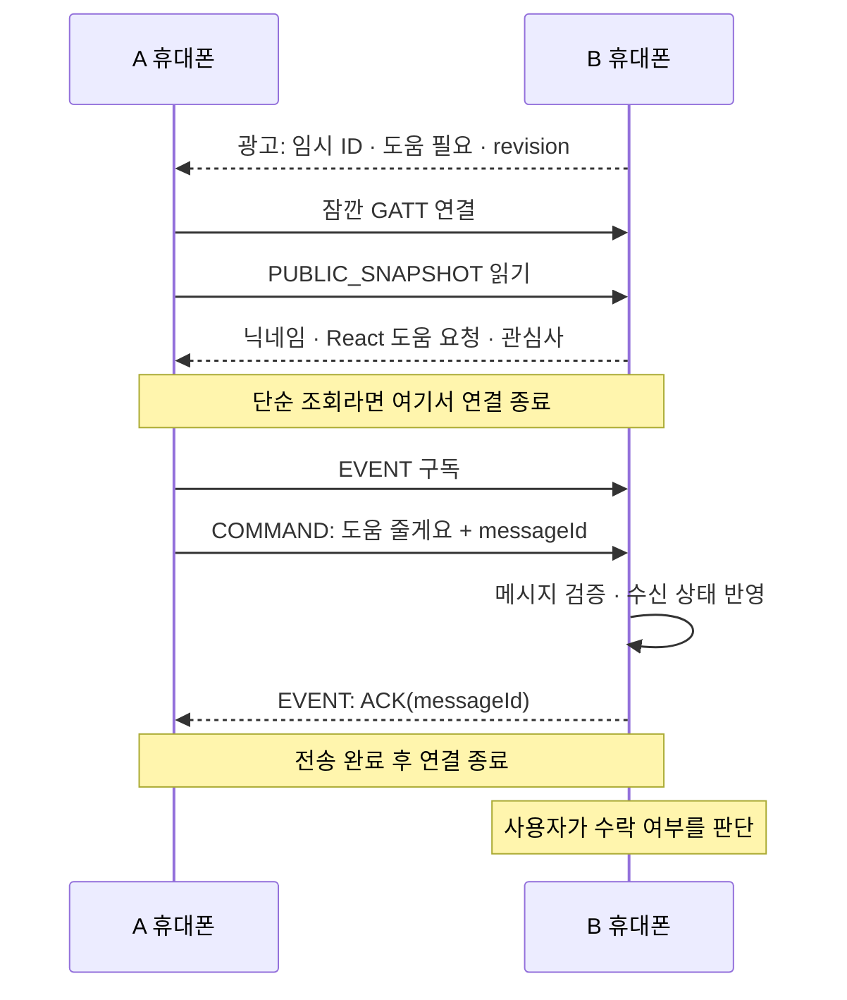

> **이력 자료:** BLE 전환 전 문서와 전환 중 안내를 보존한 자료입니다. 본문의 현재·확정 표기는 현행 요구가 아닙니다. [최신 결정](../../../product-direction.md)을 따릅니다.

# BLE 구현 설계안 v0.1

> **2026-09-19 제품 방향 전환:** 이 문서는 과거 기술 조사·후보 설계입니다. BLE 방향 채택이 기존 Android·GATT·무서버 설계 전체의 채택을 뜻하지 않습니다. 플랫폼과 발견·전송 책임은 새 결정에 맞춰 갱신합니다. 현재 결정과 문서 전환 상태는 [BLE 근접 교류 전환](../../../product-direction.md)을 먼저 확인합니다.

상태: **Android 네이티브를 기준으로 한 초기 BLE 후보 설계. 코드 구현·실기기 검증 전이다.** 현재 개발 환경은 선택 근거에서 제외한다. iOS 호환과 백그라운드 상시 동작까지 검증한 설계는 아니다. 이후 사용자는 BLE를 수단 후보로 두고, 같은 행사 방 전체에서 별도 수락 절차 없는 1:1 채팅을 지원하기로 결정했다. 이 문서의 근접 발견·반응 교환 예시를 현재 MVP의 확정 흐름으로 사용하지 않는다. 최신 결정은 [기획 문서](planning.md)를 따른다.

핵심은 **광고로 주변 상태를 발견하고, 필요할 때 GATT로 상세 정보와 반응을 교환하는 것**이다. GATT server는 휴대폰 내부의 BLE 역할을 뜻하며 인터넷 서버가 아니다. 아래 크기·시간·동시성 제한은 첫 검증에 사용할 제안값이다.

## 1. 각 휴대폰이 수행할 역할

| 역할 | Android API | 책임 |
| --- | --- | --- |
| 내 존재·상태 알리기 | `BluetoothLeAdvertiser` | 연결 가능한 BLE 광고 전송 |
| 주변 상태 발견 | `BluetoothLeScanner` | 우리 서비스의 광고만 필터링 |
| 내 정보 제공·반응 수신 | `BluetoothGattServer` | 공개 프로필 읽기, 메시지 수신과 응답 |
| 상대 정보 조회·반응 전송 | `BluetoothGatt` | 상대에게 연결해 읽기·쓰기·응답 구독 |

모든 앱은 이 역할을 모두 구현한다. 프로필 조회나 반응 전송을 시작한 쪽이 해당 연결의 GATT client가 되고, 상대가 server가 된다. 별도 중계 폰이나 모든 참가자 간의 상시 연결은 두지 않는다. 광고·스캔·연결의 동시 동작 한계는 기기 조합별로 시험한다.

앱에서 공유를 시작하면 권한과 Bluetooth 상태 확인 → 임시 ID 생성 → GATT service 등록 성공 확인 → 광고와 스캔 시작 순서로 실행한다. UI 재구성마다 광고나 스캔을 재시작하지 않는다. 공유 종료 시 광고·스캔·연결·GATT server를 정리한다.

근거: [광고 API](https://developer.android.com/reference/android/bluetooth/le/BluetoothLeAdvertiser), [스캔](https://developer.android.com/develop/connectivity/bluetooth/ble/find-ble-devices), [GATT server](https://developer.android.com/reference/android/bluetooth/BluetoothGattServer).

## 2. 연결 전 광고: 주변 목록에 필요한 최소 정보

연결 가능한 legacy advertising을 사용한다. 일반적인 discoverable 광고의 31바이트 안에 다음처럼 담는 안이다.

| 구성 | 바이트 | 내용 |
| --- | ---: | --- |
| Flags AD 구조 | 3 | 플랫폼이 광고 설정에 따라 포함 |
| Service Data의 길이·타입 | 2 | BLE 광고 구조의 헤더 |
| 커스텀 Service UUID | 16 | 우리 앱의 프로토콜 식별자 |
| 앱 payload | 10 | 아래 정의 |
| 합계 | 31 | 기기 이름·Tx Power·별도 UUID 목록은 추가하지 않음 |

앱 payload는 고정 길이 10바이트다.

| offset | 길이 | 필드 |
| --- | ---: | --- |
| 0 | 1 | 상위 4비트는 프로토콜 버전, 하위 4비트는 상태 코드 |
| 1 | 8 | 공유 세션마다 보안 난수로 생성하는 임시 ID |
| 9 | 1 | 공개 정보 변경 시 증가하는 revision 힌트, 256에서 순환 |

상태 코드 후보는 대화 가능·집중·쉬기·도움 필요·함께할 사람이다. 상태 코드의 최종 의미는 제품 설계와 맞춰 고정한다. 임시 ID는 인증 수단이 아니며 사람의 영구 식별자로 쓰지 않는다.

Service UUID는 프로젝트 전용 128비트 값을 한 곳에서 고정한다. `addServiceData(uuid, payload)`만 넣고 이름·Tx Power는 제외한다. 광고 등록 실패 콜백, 특히 데이터 크기·지원 불가 오류를 화면에 전달한다.

**스캔 필터는 `setServiceData`를 사용한다.** 이 포맷에는 별도 Service UUID 목록이 없으므로 `setServiceUuid`만으로 필터링하면 안 된다. 첫 바이트의 버전 부분만 마스킹해 필터링한다. 버전 1이라면 비교값 `0x10`, 마스크 `0xF0`이다. 수신 후 payload 길이·버전·상태를 다시 검증한다.

근거: [ScanFilter.Builder](https://developer.android.com/reference/android/bluetooth/le/ScanFilter.Builder), [AOSP 광고 크기 계산](https://android.googlesource.com/platform/packages/modules/Bluetooth/+/refs/heads/main/framework/java/android/bluetooth/le/BluetoothLeAdvertiser.java). 패킷 크기는 Android 광고 크기 계산과 실기기 등록 결과를 모두 확인한다. 확장 광고 지원을 필수 조건으로 삼지 않는다.

## 3. 발견 목록과 갱신

광고만 받아도 `임시 ID → 상태, revision, 마지막 수신 시각, 현재 연결용 기기 참조`를 만들 수 있다. 따라서 `대화 가능 3명 · 도움 필요 1명`은 상세 프로필을 내려받기 전부터 표시할 수 있다.

- 같은 임시 ID의 반복 광고는 항목 추가가 아니라 갱신이다. Bluetooth MAC 주소를 영구 사용자 ID로 저장하지 않는다.
- ‘방금 발견’은 수신 측의 단조 증가 시계로 판단한다. 휴대폰 시각 동기화는 필요하지 않다.
- 첫 제안값으로 마지막 광고 수신 후 30초가 지나면 목록과 프로필 캐시에서 제거한다. 이는 신선도 기준이며 실제 거리의 증명이 아니다.
- 상태나 프로필 수정 시 revision을 증가시키고 광고를 갱신한다. legacy 방식은 광고 중단·재시작이 필요하므로 빠른 연속 편집을 합쳐 마지막 값으로 한 번 갱신한다.
- 1바이트 revision은 갱신 힌트다. 순환할 수 있으므로 카드 선택 시에는 항상 상세 정보를 다시 읽고, 자동 캐시에도 최대 30초의 유효기간을 둔다.
- 상태 자체의 유효기간과 ‘더 이상 발견되지 않음’은 구분한다. 상태는 사용자가 지정한 만료 또는 공유 종료에 따라 로컬에서 종료하고 광고를 멈춘다. 다른 폰에서 이미 받은 정보는 다음 만료까지 남을 수 있다.

닉네임·도움 문구·관심사가 필요한 카드만 연결해서 읽는다. 첫 화면에서 자동 보강하는 후보는 최대 3개, 내보내는 GATT 연결은 한 번에 1개로 제한한다. 사용자 선택 작업을 자동 조회보다 우선한다. 사람이 많은 공간에서는 우선 집계가 보이고 상세 카드가 점차 채워지는 흐름이다.

## 4. 연결 후 GATT: 공개 정보와 짧은 메시지

커스텀 service에 다음 세 characteristic을 둔다. 각 UUID는 프로토콜 상수로 공유한다.

| 이름 | 속성 | 데이터 |
| --- | --- | --- |
| `PUBLIC_SNAPSHOT` | Read | 임시 ID, 전체 revision, 닉네임, 상태, 짧은 문구, 관심사 |
| `COMMAND` | Write with response | 보내는 사람의 공개 정보, 반응 종류, 메시지 ID |
| `EVENT` | Indicate | 앱의 처리 결과 ACK 또는 오류 |

`PUBLIC_SNAPSHOT`은 UTF-8 JSON 최대 512바이트로 제한한다. 문자 수가 아니라 직렬화한 바이트 수로 검사한다. 사진은 이 프로토콜에 넣지 않는다. 임시 ID와 revision도 포함해 광고에서 본 대상·상태와 비교한다.

예시 데이터 계약은 다음과 같다. 필드명과 상태 값은 구현을 시작할 때 한 곳에서 고정한다.

```json
{"v":1,"sid":"8ac43f009d1207be","rev":12,"name":"민수","state":"HELP","text":"React 상태 관리가 막혔어요","tags":["React","frontend"]}
```

긴 읽기를 지원하려면 server의 `onCharacteristicReadRequest`에서 offset을 처리한다. offset 0에서 연결별 스냅샷을 고정하고, 이후 offset에도 동일한 바이트열을 반환한다. 응답 조각은 `MTU - 1` 이내이며, 끝 위치는 빈 성공 응답, 범위를 넘는 offset은 오류로 처리한다. 읽는 중 프로필이 바뀌어 JSON이 섞이지 않게 한다. 실제 Android long read 결과는 실기기 검증 항목에 포함한다.

`EVENT`에는 CCCD(`0x2902`)를 둔다. client는 로컬 알림 활성화와 CCCD의 indication 활성화 쓰기를 모두 완료한 뒤 COMMAND를 보낸다. server는 연결별 구독 상태를 관리하고 `notifyCharacteristicChanged(..., confirm=true, ...)`로 응답한다. API 33 이상과 이전 API의 호출 형태 차이는 BLE 계층에서 감춘다.

근거: [GATT server callback](https://developer.android.com/reference/android/bluetooth/BluetoothGattServerCallback), [응답·indication API](https://developer.android.com/reference/android/bluetooth/BluetoothGattServer), [client 구독 절차](https://developer.android.com/develop/connectivity/bluetooth/ble/transfer-ble-data).

## 5. 메시지의 분할·확인·재시도

상대 기기가 큰 MTU를 수락한다는 가정은 하지 않는다. 기본 ATT MTU 23에서도 동작하도록 COMMAND와 EVENT를 분할한다. Android 14 이상은 첫 MTU 요청에서 517을 요청하는 동작이 있으므로 요청값보다 `onMtuChanged`의 실제 결과를 사용한다. [MTU API](https://developer.android.com/reference/android/bluetooth/BluetoothGatt#requestMtu(int))

- 직렬화된 메시지 본문 상한: 512바이트.
- 프레임 헤더: 전송 ID 2바이트 + 조각 번호 1바이트 + 전체 조각 수 1바이트.
- 쓰기·indication 프레임 상한: `min(MTU - 3, 512)`. 본문 조각 상한은 여기서 헤더 4바이트를 뺀 값이다.
- MTU 23이면 본문은 조각당 16바이트, 512바이트 본문은 최대 32조각이다.
- 프레임 재조립은 연결·방향·전송 ID별로 구분한다. 바이트 순서는 big-endian, 조각 번호는 0부터 시작한다. 순서·길이·전체 조각 수를 검증하고 불일치·연결 종료·시간 초과 시 버린다.
- 연결마다 GATT 작업 큐를 둔다. 쓰기는 콜백을 받은 후 다음 조각을 보낸다. server의 indication도 `onNotificationSent`를 받은 후 다음 조각을 보낸다. 부분 메시지는 UI에 전달하지 않는다.

COMMAND 프레임은 offset 0의 일반 write request만 허용한다. `preparedWrite`는 지원하지 않는다는 오류로 응답하고, 긴 메시지는 위의 앱 프레임으로만 나눈다. `responseNeeded`인 요청에는 성공·실패 모두 `sendResponse`를 호출해 상대 작업 큐가 멈추지 않게 한다. 앱 메시지 자체의 처리 결과는 별도의 EVENT ACK로 보낸다.

본문에는 별도의 128비트 `messageId`, 보내는 세션 ID, 대상 세션 ID, 반응 종류를 넣는다. 특정 상태에 대한 반응이면 조회한 전체 revision도 넣어 오래된 상태에 대한 반응을 구분한다. 임시 ID가 광고와 다르거나 대상 세션이 끝났으면 전송을 취소하고 새로고침한다.

수신 앱은 재조립·검증 후 상태 저장소에 반영하고 `ACK(messageId, result)`를 보낸다. GATT write 성공은 조각을 받았다는 뜻일 뿐 최종 앱 처리를 뜻하지 않는다. ACK를 받은 후 전송 완료로 표시한다. ACK 자체에 다시 ACK를 보내지는 않는다.

첫 제안값은 연결 타임아웃 5초, 개별 작업 3초, 연결된 교환 전체 10초다. 실패 시 같은 messageId로 최대 1회 자동 재시도하고 이후 수동 재시도를 제공한다. 자동 재시도에는 0.5~1.5초 무작위 지연을 둔다. 수신 측은 세션 동안 최근 messageId와 결과를 제한된 캐시에 보관해 같은 ID의 재전송에는 결과만 다시 반환한다. 캐시 수명을 넘긴 재전송은 새 요청으로 취급될 수 있으므로 영구적인 exactly-once 전달을 주장하지 않는다.

첫 구현은 내보내는 연결 1개, 들어오는 연결 1개를 목표로 한다. 같은 사람과 동시에 전송을 시작해 연결이 두 개 생겨도 각각 짧게 종료한다. 화면은 상대 세션 ID별로 묶고 수신·송신 메시지를 별도로 보존한다. 서로 요청했다는 이유만으로 대화 수락을 자동 처리하지 않는다. 이 동시 역할을 지원하지 못하는 기기는 오류 후 재시도하게 하고 지원 여부를 실기기 결과로 기록한다.

## 6. 두 사람 사이의 실제 흐름



제품에 ‘좋아요’ 같은 수락 기능을 넣는다면 B가 나중에 A에게 새로 연결해 원래 messageId를 참조하는 응답을 보낸다. BLE 연결을 사람이 생각하는 동안 붙잡아 두지 않는다. 상대가 이미 떠났으면 즉시 전달할 수 없으며, 인터넷 중계나 오프라인 우편함을 구현한 것처럼 표시하지 않는다.

ACK는 앱 수신 확인이고 사람의 수락이 아니다. 사람이 수락했더라도 실제 대면 교류가 일어났다는 증거는 별도로 정해야 한다.

## 7. 권한·공개 범위·지원 범위

Android 12 이상에서는 사용 기능에 맞춰 `BLUETOOTH_SCAN`, `BLUETOOTH_ADVERTISE`, `BLUETOOTH_CONNECT` 권한을 요청한다. Android 11 이하를 지원하면 해당 OS의 위치 권한 흐름도 추가해야 한다. `neverForLocation`은 물리적 위치를 추론하지 않는다고 선언하는 옵션이므로, 이 서비스의 근접성·RSSI 사용 방침과 맞는지 확인한 뒤 결정한다. 일부 비콘이 필터링될 수도 있다. [Android 권한 문서](https://developer.android.com/develop/connectivity/bluetooth/bt-permissions)

첫 구현·시연은 두 앱이 화면에 열린 상태를 대상으로 한다. 다른 앱 위의 플로팅 아이콘, 잠금 화면에서도 계속 발견, iOS 교차 통신은 별도 검증 과제로 둔다. 이 경계는 최종 제품 범위 제안이지 이미 합의된 제외 목록은 아니다.

이 교환에 인터넷 서버는 필요하지 않다. 다만 **인터넷 서버가 없다는 것만으로 비밀 통신이나 신원 인증이 성립하지 않는다.** 초기 제안은 주변 사람에게 공개해도 되는 상태·프로필만 취급한다. 공개 GATT 값을 읽는 것과 인증된 행사 참가자인지를 구분하고, 임시 ID만으로 인증 배지를 표시하지 않는다. AI가 외부 API를 호출할지는 별도 데이터 정책 결정이다.

## 8. 팀의 구현 경계와 검증 순서

| 작업 단위 | 구현 책임 | 함께 맞출 계약 |
| --- | --- | --- |
| 발견 | 광고 인코더·스캔 디코더·상태 갱신·목록 만료 | UUID, 10바이트 포맷, 상태 코드 |
| 연결·메시지 | GATT client/server·큐·분할·ACK·정리 | characteristic UUID, JSON 스키마, 오류 코드 |
| 화면·상태 | `NearbyRepository`를 통한 목록·상세·전송 상태 표시 | 발견·미확인·전송 중·완료·실패의 의미 |
| 검증·AI 연계 | 실기기 시나리오, 추천에 사용할 공개 데이터, 발표 증거 | 검증된 지원 범위와 허용 데이터 |

이 표는 작업 경계이며 인원 배정은 아니다. UUID·코덱·JSON 예시는 저장소에서 한 곳에 관리하고 UI 개발에는 같은 계약의 FakeNearbyRepository를 사용한다. 가짜 데이터 모드는 명시하며 실기기 성공 근거로 사용하지 않는다.

구현 순서는 광고 1방향 → 상호 스캔과 상태 갱신 → 한쪽에서 프로필 읽기 → COMMAND/ACK → 역방향 전송 → 3대 참여 순서다. 첫 45~60분 기술 검증은 상호 발견과 짧은 프로필 읽기까지를 목표로 하고, 전체 재시도·분할 구현 완료 시간으로 약속하지 않는다.

| 검증 | 완료 근거 |
| --- | --- |
| 광고 패킷 | 실제 등록 성공, 10바이트 왕복 파싱, 잘못된 버전·길이 거부 |
| 인터넷 없는 교환 | Wi-Fi·모바일 데이터 OFF에서 상호 발견·상태 갱신·프로필·반응 성공 |
| MTU와 한글 | MTU 23에서 최대 길이 한글 프로필 읽기·메시지 분할 교환 |
| 반복과 끊김 | ACK 전 끊김 후 같은 ID 재시도 시 수신 메시지가 중복 추가되지 않음 |
| 상태 신선도 | 상태 변경 반영, 공유 종료 후 30초 안에 기존 목록 만료 |
| 경쟁 | 양쪽 동시 반응 및 3대 참여 시 콜백이 서로 다른 요청에 섞이지 않음 |
| 권한·기기 | 권한 거부·Bluetooth OFF·광고 미지원에서 명확한 복구 화면 |

발견 5초 이내·짧은 반응 교환 2초 이내는 튜닝 목표다. 연결 전송인지 이미 연결된 전송인지 구분하고, 성공 횟수와 지연을 실제 기기에서 기록한다. 테스트 전에는 성능 보장으로 쓰지 않는다.
