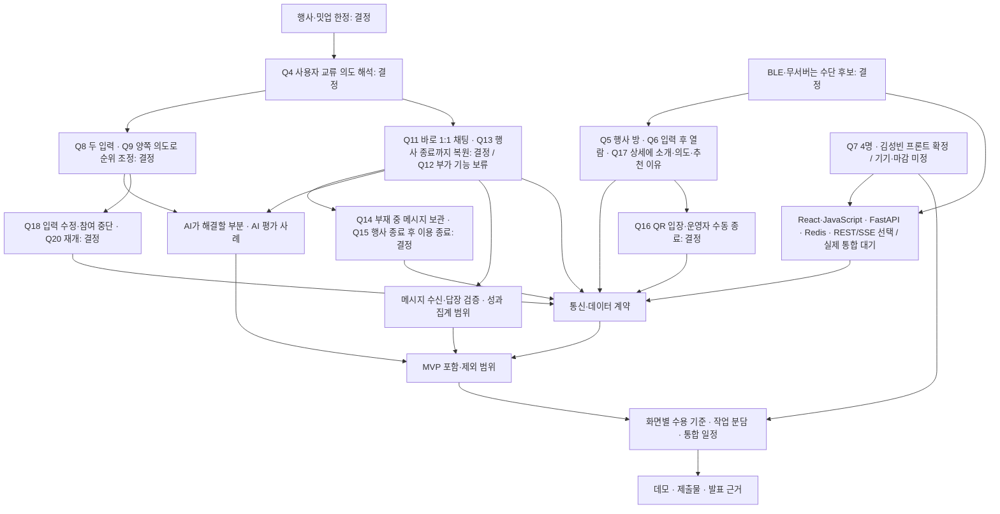

# 제품 구체화와 결정 기록

상태: **Q1~Q20과 최신 main 비교 반영 완료. 사용자가 충돌 시 더 나은 방식을 채택하도록 위임해 개발 기준을 통합했다. 현재 코드는 mock 화면·서버 기반까지이며, 제품 API와 두 사용자 통합 검증은 다음 작업이다.**

## 현재 인터뷰의 작업 기준

기획을 `861fab6`으로 먼저 커밋하고 원격 main `baea7518c4820b249dfe3c90151302fc0833ce06`을 비교했다. 충돌 시 더 나은 방식을 채택하라는 위임에 따라 사용자 제품 결정은 유지하고, 실제 구현 자산을 고려해 JavaScript·Redis·기존 Nginx 기반을 선택했다. 현재 내용은 main을 기준으로 만든 별도 PR의 변경안이며, PR 생성이 main 병합을 뜻하지 않는다. 변경 근거와 검증은 [비교 기록](reviews/baea751.md)에 남긴다. 팀원이 독립적으로 쓴 ‘확정’ 표기만으로 사용자 결정을 덮어쓰지 않는다.

## 근거와 확정 범위

- 사용자 요청: 주제는 교류이며 평가 요소를 중요하게 다룬다. 팀 개발용 저장소에 남길 문서를 만든다.
- 1라운드 사용자 결정: **MVP는 행사·밋업만 고려한다. BLE·무서버는 필수 원칙이 아닌 수단 후보다.** 행사 안에서의 주 사용자·해결할 핵심 불편은 다음 라운드에서 좁힌다.
- 1라운드 후속 요청: main의 팀원 PRD 등 명세를 제품·팀 계획의 참고 자료로 읽되, 독립적으로 작성되어 부족하거나 보완할 부분이 있을 수 있음을 고려한다.
- Q4 사용자 결정: **사용자가 앱을 시작할 때 만나고 싶은 사람에 대한 맥락을 받고, LLM이 그 교류 의도를 해석한다.** 유사성·상보성 등 가능한 연결 유형을 제품이 미리 모두 열거하거나 하나로 제한하지 않는다. 실제 입력 항목·공개 범위·추천 방향은 후속 결정 대상이다.
- Q5 사용자 결정: **추천 후보는 같은 행사 방의 참가자 전체다.** 같은 테이블·구역이나 실제 근접 탐지 결과로 제한하지 않는다. 방 소속을 물리적 거리의 증거로 표현하지 않는다. 구체적인 입장 방식과 플랫폼은 별도 설계한다.
- Q6 사용자 결정: **참여에 필요한 정보를 입력한 뒤 다른 참가자의 정보를 열람한다.** 입력 완료 전에는 참가자별 닉네임·소속·상태·한 줄을 공개하지 않는다. 미리보기를 제공한다면 인원·상태 집계 범위로 제한한다. 필수 입력 항목과 참여 후 구체적인 공개 필드는 후속 입력 설계에서 정한다.
- Q7 사용자 답변: **팀은 4명이며 김성빈이 프론트를 담당한다.** 나머지 3명의 역할은 미정이고, 한 명은 개발에 익숙하지 않다. 네 명 모두 Claude Code·Codex·agy 등의 도구로 개발할 예정이다. 사용자 요청에 따라 숙련도와 작업 경계를 고려한 분업 경우를 비교한다. 시연 기기와 내부 마감은 아직 미확인이다.
- Q8 사용자 결정: **짧은 자기소개와 지금 만나고 싶은 사람을 각각 자유롭게 입력한다.** 자기소개는 본인 정보, 만나고 싶은 사람에 대한 설명은 교류 의도로 구분한다. 두 입력을 하나의 문장으로 합치거나 관계 유형 선택으로 대체하지 않는다. 길이 제한·빈 입력 처리·참여 후 공개 필드는 후속 설계 대상이다.
- Q9 사용자 결정: **양쪽 교류 의도를 점수에 반영하되, 의도가 충돌해도 참가자 목록에서 제거하지 않고 추천 우선순위를 낮춘다.** 점수 산정 방법은 미정이며 정확성과 효율을 비교해 AI 담당이 결정한다. LLM-as-judge는 후보 방식 중 하나이며 채택을 확정하지 않았다.
- Q10 당시 결정: **자기소개는 공개하고 ‘만나고 싶은 사람’ 원문은 UI 정보량 때문에 우선 AI 추천에만 사용**했다. 이후 Q17에서 사용자 배너를 누른 상세 화면에 교류 의도도 보여주는 방향으로 변경했다. 현재 공개 계약은 Q17을 따른다.
- Q11 사용자 결정: **목록에서 상대를 고르면 바로 1:1 채팅을 보낼 수 있고, 수신자가 대화를 이어갈지 결정한다.** 별도의 대화 제안·수락·거절 절차는 두지 않는다. 앱은 채팅까지 지원하며 실제 만남으로 이어갈지는 참가자가 대화 안에서 정한다. Instagram은 이 상호작용을 설명한 비유이며 기능 전체를 복제하라는 요구가 아니다.
- Q12 사용자 답변: **사진은 MVP에서 제외하는 방향이며, 파일·읽음·푸시 등 부가 채팅 기능은 지금 중요하게 다루지 않고 보류한다.** 이를 재질문하거나 개발 착수의 선결 조건으로 삼지 않는다. 앞선 BLE 전송 제약 질문은 BLE 채택 확정이 아니다. 텍스트 송수신과 기존 대화 복원은 다른 답변에서 확정된 요구에 따라 설계한다.
- Q13 사용자 결정: **같은 기기·브라우저에서 새로고침하거나 브라우저를 닫았다가 돌아와도 행사 종료까지 자기소개·교류 의도와 기존 채팅을 복원한다.** 다시 참여 정보를 입력하거나 기존 대화를 잃지 않게 한다. 앱을 닫은 동안 도착하는 메시지 처리와 행사 종료 후 열람·삭제 정책까지 확정한 것은 아니다.
- Q14 사용자 결정: **잠시 앱을 닫은 참가자도 목록에 유지하고 메시지를 보관했다가 재접속 시 전달한다.** 실시간 접속 여부 표시는 우선 필수로 두지 않는다. 잠시 부재한 사람을 행사에서 나간 사람으로 취급하거나 목록에 있다는 이유로 접속 중이라고 표시하지 않는다.
- Q15 사용자 결정: **행사 종료 후에는 종료 안내를 보여주고 참가자 목록·채팅 열람과 전송을 종료한다.** 기존 채팅의 읽기 전용 이용도 현재 범위에 넣지 않는다. 실제 데이터 삭제 시점은 이용 종료와 구분해 저장 계약에서 명시한다.
- Q16 최종 결정: **팀이 행사 방과 QR·링크를 준비하고, 참가자는 계정 없이 닉네임·자기소개·교류 의도로 입장한다. 종료 예정 시각은 받지 않고 운영자가 수동으로 종료한다.** 일반 참가자에게 행사 종료 권한을 주지 않는다. 방 생성 관리 화면은 이번 범위에 넣지 않는다.
- Q17 사용자 답변: **숫자 점수 표시는 보류하고, 사용자 배너를 누른 상세 화면에 추천 이유와 그 사용자가 찾는 사람을 보여주는 방향**으로 구체화한다. 목록에 상세 정보를 모두 펼치지 않고 자기소개·교류 의도와 추천 이유를 상세에서 확인한다. 교류 의도가 계속 AI 전용이라는 Q10의 임시 표시 기준을 변경한다.
- Q18 사용자 결정: **자기소개·교류 의도는 수정 가능해야 하며, 참여 중단 시 목록에서 제외하고 새 메시지 송수신을 중단하되 기존 대화는 행사 종료까지 열람**한다. 단순히 앱을 닫는 Q14의 부재와 다르다. Q20에서 같은 참가자로 재개하기로 결정했다.
- Q19 사용자 결정: **같은 자기소개에 서로 다른 교류 의도를 준 추천 비교와 실제 두 사용자의 답장을 핵심 시연으로 삼는다.** 참가자가 사용자, 행사 운영진이 도입 고객 후보라는 사업 가설로 설명한다. 운영진 대시보드 구현은 보류하고 실제 사용 관찰과 AI 비교 결과를 준비한다.
- Q20 사용자 결정: **참여 중단 후 같은 참가자로 재개하고 기존 대화를 유지한다.** 중단 중에는 새 메시지 전송을 거부하며, 재개 후부터 새 송수신을 허용한다. 중단 중 거부된 메시지를 나중에 전달하지 않는다.
- [4인 분업과 통합 계획](team-plan.md): 프론트/서버·통합/AI/검증·시연을 추천하고, 프론트 2인 구성·통합 전담 구성을 대안으로 비교했다. 김성빈 외 역할 배정은 제안이며 확정하지 않았다.
- 후속 지시: 스택 선택은 어시스턴트에게 위임한다. **현재 작업 환경에 설치된 도구·운영체제는 스택 선택 근거에서 제외한다.** 제품 요구와 해커톤 평가·시간 제약을 기준으로 비교한다.
- Q15 이후 초기 기술 선택은 React·Vite·TypeScript + FastAPI + SQLite였다. **최신 main 비교 후의 현행 선택은 React·Vite·JavaScript + FastAPI + Redis(AOF·영속 volume)**다. TypeScript 전환과 저장 기반 교체를 선행하지 않고 기존 코드를 활용한다. REST 전송·이력 조회, SSE 갱신, 같은 출처·단일 worker, BLE 제외는 유지한다. [MVP 개발 기준](development-contract.md)에 현재 책임 경계와 검증 조건을 기록했다.
- [팀 논의 원문](discussedw-raw.md): 초기 아이디어와 서로 다른 제안을 담은 자료다. 모든 문장을 합의된 요구사항으로 보지 않는다.
- [해커톤 제약](hackathon-brief.md): 제공된 이미지에서 확인한 배점과 제출·발표 조건이다.
- [주제 평가와 검증 계획](topic-evaluation.md): 행사 첫 대화·해커톤 도움 연결·일상 교류를 배점별로 비교한 검토안이다. 기존 제품 공식 안내를 바탕으로 차별성 주장을 점검하고, AI·수요 검증과 두 사용자 시연을 제안한다.
- 논의 원문 안의 Notion 링크 본문은 이번 분석에 포함하지 않았다.
- 2026-09-19 과거 검토 `f4e0d0e`: HTML 프로토타입과 화면 캡처가 있었고 서버·앱 패키지는 없었다. 이는 당시 커밋에 한정한 기록이다.
- 2026-09-19 최신 검토 `baea751`: React/Vite mock 화면과 FastAPI·Redis·Docker 기반이 추가됐다. 프론트 빌드·린트, 서버 테스트 4개가 통과했다. 실제 제품 API·AI·사용자 간 채팅·운영 배포는 이번 검증 대상에서 완료되지 않았다. 기존 스펙의 입력·추천·수명·종료 규칙은 사용자 결정으로 갱신하고, mock 코드에서 고칠 부분은 [프론트 작업 계획](../spec/frontend-plan.md)에 남겼다.

## 원문에서 읽히는 중심 가설

> 가까이 있는 사람의 현재 상태와 대화할 이유를 알면, 처음 말을 거는 부담이 줄어 대면 교류로 이어질 수 있다.

이것은 검증할 제품 가설이다. 실제 사용자가 원하는지, 상태를 공개할 의사가 있는지, 대화가 늘어나는지는 아직 관찰하지 않았다.

원문에는 상태 표현 → 주변 사람이 인지 → 대면 교류라는 흐름이 반복된다. ‘온라인에는 상태 메시지가 있는데, 현실에는 없다’는 문장은 출발점이 되는 비유다. 기존 제품이나 현실의 명찰·상태 표시 방식이 전혀 없다는 시장 조사 결과로 사용하지 않는다.

## 현재 개발 기준과 위임 범위

| 구분 | 현재 기준 | 관리 문서 |
| --- | --- | --- |
| 제품 선택 | Q1~Q20에 따른 대상·흐름·공개·수명·시연 방향 | 이 문서의 결정 기록 |
| 개발 기준 | 포함·보류 범위, 스택, 화면·상태와 수용 조건 | [development-contract.md](development-contract.md) |
| 공통 인터페이스 | 데이터·세션·API·추천·이력·오류와 기술 기본값 | [api-contract.md](api-contract.md) |
| AI 담당 재량 | 모델·점수 산정·캐시·평가 전략. 순위 품질·시간·비용 비교로 선택 | 개발 기준과 검증 계획의 제약 안에서 결정 |
| 팀 실행 조건 | 김성빈 외 실명 배정, 시연 기기, 내부 마감, 호스팅·모델 접근 확인 | [team-plan.md](team-plan.md)의 담당 역할별 인계 |
| 최종 확인 | 아래 개발 인계가 합의한 제품을 정확히 옮겼는지 확인 | 최종 요약. 앱 구현 허가를 대신하지 않음 |

아래 라운드 기록은 당시 질문과 답변의 이력이다. 앞선 임시안과 뒤의 결정이 다르면 Q16·Q20까지 반영한 개발 기준을 따른다.

## 1라운드: 독립적으로 답할 수 있는 질문

| ID | 질문 | 현재 제안 | 상태 |
| --- | --- | --- | --- |
| Q1 | 이번 MVP가 해결할 첫 사용 장면은? | 행사·밋업에서 혼자 온 참가자의 첫 대화 | 사용자 결정: 행사·밋업 한정. 첫 대화라는 구체적 문제·성공 기준은 다음 라운드에서 확인 |
| Q2 | BLE와 서버 없음은 필수 원칙인가, 수단 후보인가? | 수단 선택을 열어두고 제품 흐름에 따라 비교 | 사용자 결정: 수단 후보. 특정 통신 방식 채택까지 확정한 것은 아님 |
| Q3 | 개발 참여 인원·각자 익숙한 분야·시연 기기의 OS와 대수·내부 기능 개발 마감은? | main 명세의 역할·일정안을 우선 확인 | 당시 main은 3명 가정. 이후 Q7에서 실제 4명·김성빈 프론트 담당으로 정정. 자정 마감·시연폰 2대는 아직 계획 수준 |

2026-09-19 자료 재검토 후 이번 라운드는 Q1에 행사 첫 대화·해커톤 도움 연결·일상 교류를, Q2에 수단 선택 개방·BLE 필수+보조 서버 허용·완전 무서버를 제시했다. Q2의 추천은 기존 ‘BLE 우선 검증’에서 ‘수단 선택 개방’으로 조정했다. 문제 해결력·완성도가 55점이고, BLE를 필수로 삼아야 하는 제품 요구는 아직 합의되지 않았기 때문이다. 이는 BLE 제외나 웹 채택을 확정한 결정이 아니다. Q3에서는 팀의 익숙한 분야·실제 시연 기기·내부 개발 마감을 확인한다. 기존 문서에 기록된 스택 선택 위임을 다시 승인받는 질문이 아니다. 답변 전까지 추천안과 실제 결정은 구분한다.

추천은 합의가 아니다. 위 표의 사용자 결정만 확정으로 반영하고, 그 답변으로 결정 가능한 다음 질문을 정한다.

BLE·무서버를 수단 후보로 두기로 결정했으므로 일반 웹도 정식 후보로 비교한다. **휴대폰 간 BLE 자동 발견·직접 공유**와 **같은 행사·구역 참가자 사이의 서버 기반 상태 공유**는 서로 다른 제품 약속이므로 구분한다. 상세 근거는 [웹의 적용 범위](technical-findings.md#일반-웹의-적용-범위)에 기록한다.

## 2라운드: main 검토 후 결정할 질문

[당시 main 검토](reviews/f4e0d0e.md)에 명세 충돌·프로토타입 실제 동작·팀 계획의 근거를 기록했다. 최신 비교는 [baea751 검토](reviews/baea751.md)다. 예시 AI·채팅·집계를 실제 구현 완료로 보지 않는다. 아래 질문은 당시 답변과 원격 자료 확인으로 결정 가능해진 항목이다.

| ID | 질문 | 추천 | 상태 |
| --- | --- | --- | --- |
| Q4 | 연결 관계를 미리 정할 것인가, 사용자가 원하는 사람의 맥락을 받을 것인가? | 기존 유사성·상보성 선택 질문을 사용자 설명에 따라 수정 | 사용자 결정: 교류 의도를 맥락으로 받아 LLM이 해석. 관계 유형을 사전 고정하지 않음 |
| Q5 | 추천 대상은 같은 행사 방 전체인지, 선택한 구역인지, 실제 근접 탐지 대상인지? | 같은 행사 방 전체를 대상으로 추천 | 사용자 결정: 같은 행사 방 전체. 거리·구역·BLE 발견은 필수 후보 조건이 아님 |
| Q6 | 입장 전 참가자별 정보를 공개할지? | 입력 전 미리보기가 있다면 인원·상태 집계만 제공 | 사용자 결정: 입력한 뒤 참가자별 정보를 열람. 필수 입력 항목·참여 후 공개 필드는 후속 결정 |
| Q7 | 실제 인원·역할·개발 경험·시연 기기·내부 마감은? | 4인 분업 경우를 비교하고, 미배정 역할은 이름 없이 작업 묶음으로 구체화 | 사용자 확인: 4명, 김성빈 프론트, 나머지 3명 미배정, 개발에 익숙하지 않은 사람 1명, 전원 AI 개발 도구 사용. 기기·마감 미확인 |

Q4 답변은 ‘유사성과 상보성을 둘 다 지원한다’는 분류 추가가 아니다. 사용자가 원하는 사람의 조건과 이유를 맥락으로 제공하고, 그 의도에 따라 추천의 적합성을 판단한다는 방향이다. 이 개념을 용어집에 **교류 의도**로 기록했다. 이어 Q5에서 같은 행사 방 전체를 추천 대상으로, Q6에서 입력 완료 후 참가자별 정보 열람을 확정했다. Q7의 인원·프론트 담당·개발 경험·도구 사용 계획은 확인했으며, 기기와 내부 마감은 미확인으로 남긴다. 이 미확인 사항은 입력·추천에 관한 독립적인 논의를 막지 않는다.

Q6에 따른 흐름은 **행사 확인 → 참여 정보 입력 → 참가자 목록·추천 열람**이다. 기존 프로토타입의 입력 전 개인별 목록은 수정 대상이다. 추후 목록 API도 입력 완료 전 참가자별 정보를 반환하지 않는 계약으로 맞춘다. 입력 완료는 행사 참가자 신원을 인증했다는 뜻이 아니며, 별도 계정·인증 도입을 결정한 것은 아니다.

### Q4로 구체화한 제품 방향

> 행사·밋업 참가자가 지금 만나고 싶은 사람을 설명하면, 같은 행사 방에서 그 교류 의도에 맞는 참가자를 찾고 1:1 채팅으로 대화를 시작하도록 돕는다.

이 문장은 사용자 설명을 바탕으로 정리한 제품 방향이다. 추천이 실제로 적합한지, 대화로 이어지는지는 검증할 가설이다. ‘혼자 온 사람’이나 ‘도움 요청자’를 모든 참가자의 고정된 역할로 두지 않는다. 초기 원문의 대면 교류 가설은 보존하되, 현재 MVP의 필수 앱 흐름을 대면 확인까지 확장하지 않는다.

- **교류 의도와 본인 정보를 구분한다.** ‘React를 알려줄 사람을 찾는다’는 의도만으로 본인의 경험·직무·도움을 줄 수 있는 분야를 알 수는 없다. Q8에서 짧은 자기소개와 만나고 싶은 사람을 별도 자유 입력으로 받기로 정했다.
- **관계 유형은 고정된 통과 조건이 아니다.** main의 `STUCK × EXPERIENCED` 후보 제한과 기술적 사실만 추출하는 프롬프트는 이번 방향에 맞게 수정해야 한다. 유사성·상보성은 설명에 사용할 수 있는 예시이며 전체 허용 유형 목록이 아니다.
- **LLM이 정보 부족을 메우기 위해 사람의 특성을 지어내게 하지 않는다.** 의도와 후보가 제공한 정보에 근거한 추천을 제안한다. 입력이 모호하거나 후보 정보가 부족할 때 추가 질문할지 추천을 보류할지는 추후 결정한다.
- **의미 해석과 참여 조건은 분리한다.** 모델이 자유로운 의도를 해석하더라도 행사 범위·공개 범위·만료·차단 등 제품에서 정한 조건을 바꾸지 않도록 설계한다. 구체적인 조건은 해당 질문에서 확정한다.

### 3라운드: 입력과 추천 방향

| ID | 질문 | 추천 | 상태 |
| --- | --- | --- | --- |
| Q8 | 교류 의도 외에 후보 평가에 쓸 본인 정보를 어떻게 받을지? | 짧은 자기소개와 만나고 싶은 사람을 각각 자유 입력 | 사용자 결정: 두 항목을 각각 자유 입력. 길이·빈 입력 처리 등은 후속 결정 |
| Q9 | 상대의 교류 의도를 어떻게 반영할지? | 기존의 ‘의도 충돌 시 제외’ 제안을 사용자 답변에 따라 수정 | 사용자 결정: 양쪽 의도로 점수·우선순위 조정. 의도 충돌만으로 목록에서 제거하지 않음. 산정 방식은 AI 담당이 정확성·효율을 비교해 결정 |

Q8에서 입력의 의미를 확정했다. 프론트는 **자기소개 / 만나고 싶은 사람**을 구분해 받고, 서버·AI 계약도 두 원문을 별도 필드로 유지하는 방향으로 구체화한다. 예를 들어 ‘디자이너를 만나고 싶다’는 교류 의도를 본인의 디자이너 경력으로 해석하지 않는다. 실제 필드명·길이·입력 오류 처리는 계약 작성 시 고정한다.

Q9에 따라 참가자 목록의 포함 여부와 추천 우선순위를 구분한다. 예를 들어 A는 디자인 조언을 원하지만 B는 취미 대화를 원하는 경우, 이 충돌을 추천 점수에 반영하면서 B를 목록에 남긴다. 점수가 낮아도 사용자가 B의 공개 정보를 살펴볼 수 있어야 한다. 이후 Q17에서 숫자 점수 표시는 보류했다. Q18의 자발적인 참여 중단은 낮은 추천 점수와 다른 목록 제외 사유다.

### AI 담당에게 넘길 결정과 팀 공통 계약

| 구분 | 내용 |
| --- | --- |
| 확정된 제품 동작 | 자기소개와 교류 의도를 분리해 해석하고 양쪽 의도를 고려한다. 의도 불일치·낮은 추천 점수만을 이유로 행사 참가자 목록에서 제거하지 않는다. |
| AI 담당의 결정 범위 | 점수 산정 방법, 모델·평가 방식, 호출 단위, 캐시·재평가 등 정확성과 효율을 함께 다루는 구현. LLM-as-judge를 포함한 방식을 비교하되 특정 해법을 선결정하지 않음 |
| 비교할 증거 제안 | 사람이 기대 순위와 근거를 정한 동일 사례의 결과, 본인 특성 날조 여부, 응답 시간, 호출 수·비용. 점수 자체를 정확성의 증거로 삼지 않음 |
| 서버·AI 경계 제안 | 참가자 목록은 서버가 관리하고 AI는 추천 순서·평가 결과를 제공한다. 일부 후보만 평가하는 구현도 낮은 순위의 참가자를 목록에서 제거하지 않아야 함 |
| 아직 정할 계약 | 평가 완료·미평가·실패의 구분, 순위 갱신 시점, 화면에 보여줄 정보, 추천 결과가 오래됐을 때의 처리 |

‘미평가’는 ‘낮은 점수’와 다른 상태로 구분하는 방향을 제안한다. 효율을 위해 일부만 평가하더라도 전체 목록과 평가한 후보 범위를 설명할 수 있어야 한다. 같은 행사 방·입력 후 열람이라는 기존 조건은 유지하며, 퇴장·상태 만료·교류 중단의 상세 정책은 별도 결정한다.

### 4라운드: 공개 정보와 추천 이후 행동

| ID | 질문 | 추천 | 상태 |
| --- | --- | --- | --- |
| Q10 | 참여 후 자기소개와 만나고 싶은 사람의 원문을 모두 공개할지? | 기존 두 원문 공개 제안을 사용자 답변에 따라 수정 | 사용자 결정: 자기소개 공개는 확정. 교류 의도 원문은 UI 정보량 때문에 우선 AI에만 사용하고 구현 중 표시 여부 재검토 |
| Q11 | 추천에서 상대를 고른 뒤 어떤 행동을 할지? | 기존 제안·수락 절차를 사용자 답변에 따라 수정 | 사용자 결정: 바로 1:1 채팅. 수신자가 답장·대화 지속 여부를 정함. 별도 수락·거절 단계 없음 |

Q10의 임시 표시 기준을 Q17 답변에 맞춰 갱신했다. 현재 표시 기준은 아래와 같다.

| 입력 | 다른 참가자 화면 | AI 추천 | 결정 상태 |
| --- | --- | --- | --- |
| 짧은 자기소개 | 입력을 완료한 같은 행사 방 참가자에게 표시 | 후보의 본인 정보로 사용 | 공개 확정 |
| 만나고 싶은 사람 | 사용자 배너를 누른 상세 화면에 표시. 목록 배너에는 펼치지 않음 | 양쪽 교류 의도로 사용 | Q17에서 상세 표시 방향 채택 |

자기소개와 교류 의도를 받는 두 입력란은 유지한다. 목록의 간결한 배너와 상세 응답을 나누고, 상세에서 자기소개·교류 의도·나에게 추천하는 이유를 확인한다. 추천 이유는 조회하는 참가자와 상대의 관계에 따른 결과이며, 모든 사람에게 같은 이유를 보여주는 상대의 고정 프로필 필드로 취급하지 않는다. 입력 시 같은 행사 방 참가자가 상세에서 두 원문을 볼 수 있음을 안내한다. 별도 첫마디 자동 생성은 필수 기능으로 추가하지 않는다.

Q11에 따라 현재 핵심 흐름은 **행사 확인 → 자기소개·교류 의도 입력 → 추천 순위를 반영한 참가자 목록 → 상대의 자기소개 확인 → 첫 메시지 전송 → 상대의 수신·자율적인 답장**이다. 답장하지 않아도 되는 흐름이며, 별도 제안 객체나 수락 상태를 전제로 설계하지 않는다. 채팅에서도 발신자의 공개 자기소개를 확인할 수 있게 하는 방향을 제안한다.

기존 main의 ‘채팅 제외’와 ‘BLE 채팅 필수’ 명세는 모두 현재 결정에 맞게 정리해야 한다. 채팅 기능은 포함하지만 BLE를 필수 전송 방식으로 선택한 것은 아니다. 만날 장소나 외형을 알려주는 일은 사용자가 채팅으로 할 수 있으며, 별도 만남 예약·현장 식별·대면 확인 기능은 현재 필수 범위에 추가하지 않는다.

평가·시연에서는 **첫 메시지 전송, 상대의 수신, 답장이 있는 양방향 대화, 실제 대면**을 구분한다. 기본 시연은 두 실제 사용자가 메시지를 주고받는 데까지 구성할 수 있다. 채팅 건수를 실제 대면 횟수로 집계하지 않는다. 운영진에게 보여줄 최종 지표와 집계 구현 범위는 이후 결정한다.

### 5라운드: 채팅 범위와 재접속

| ID | 질문 | 추천 | 상태 |
| --- | --- | --- | --- |
| Q12 | 채팅 MVP는 어디까지 지원할지? | 1:1 텍스트·대화 목록·앱 안 새 메시지 표시·전송 실패 및 재시도 | 사진 제외 방향. 후속 답변에서 부가 기능 논의 보류. 전체 추천안을 승인한 것으로 기록하지 않음 |
| Q13 | 새로고침·브라우저 종료 후 돌아왔을 때 입력과 채팅을 복원할지? | 같은 기기·브라우저에서 행사 종료까지 복원. 행사 이후 보관과 기기 간 동기화는 별도 범위 | 사용자 결정: 같은 기기·브라우저에서 행사 종료까지 입력과 기존 채팅 복원 |

Q13에 따라 재접속 시 같은 참가자로 이어지고 기존 입력과 대화가 유지되어야 한다. 단순한 접속 중단을 참가 기록 삭제로 처리하면 이 요구를 충족하지 못한다. 기존 main의 하트비트 중단 시 삭제 규칙은 수정 대상이다. 접속 여부·목록 표시·복원에 필요한 기록 보관을 구분한다. 구체적인 식별·저장 방식은 기술 계약에서 정하며, Q13만으로 DB 종류나 BLE 채택을 확정하지 않는다.

복원 수용 기준은 **두 참가자가 실제로 채팅한 뒤 한쪽이 새로고침하고, 이어 브라우저를 닫았다가 같은 행사에 돌아와도 입력과 기존 대화가 유지되는 것**이다. 상대에게 같은 사람이 중복 참가자로 생기지 않아야 한다. Q14에 따라 부재 중 보낸 메시지도 재접속 후 확인한다. 실제 삭제 시점은 저장 계약에서 구체화한다.

Q12 부가 기능 논의는 보류하고, Q13~Q15의 확정된 흐름에 필요한 메시지 전달·보관 계약을 고정한다. 점수 구현을 AI 담당에게 위임한 범위는 다시 선택받지 않는다.

Q12 기술 확인: legacy 광고의 31바이트와 GATT 1회 전송 크기는 앱의 전체 메시지 길이와 다르다. 긴 텍스트나 파일은 조각 전송·재조립이 가능하므로 ‘BLE라 사진을 보낼 수 없다’를 사진 제외 근거로 삼지 않는다. 실제 전송 성능과 연결 안정성은 실기기 검증 대상이다. [상세 근거](technical-findings.md#광고-크기와-채팅-메시지-길이)

### 6라운드: 부재와 행사 종료

아래 사용자 답변으로 부재·이용 종료를 확정했다. Q12 부가 기능은 보류이며 더 상세한 선택을 요구하지 않는다.

| ID | 질문 | 추천 | 상태 |
| --- | --- | --- | --- |
| Q12 보완 | 사진 외에 파일·읽음 표시·앱을 닫았을 때 푸시도 이번 MVP에서 제외할지? | 텍스트·대화 목록·앱 안 새 메시지 표시·전송 실패 및 재시도에 집중 | 사용자 답변: 중요하지 않으므로 일단 고려하지 않음. 부가 기능 설계 보류 |
| Q14 | 잠시 앱을 닫은 참가자를 목록에서 보고 메시지를 보낼 수 있을지? | 목록에 유지하고 메시지를 보관해 재접속 시 전달. 실시간 접속 표시는 우선 필수로 두지 않음 | 사용자 결정: 추천안 채택 |
| Q15 | 행사 종료 후 기존 채팅을 계속 열람할 수 있을지? | 종료 후에는 종료 안내만 제공하고 참가자 목록·채팅 열람과 전송을 끝냄. 실제 삭제 시점은 별도 데이터 계약에서 명시 | 사용자 결정: 추천안 채택 |

Q14로 **잠시 앱을 닫음**과 **행사 참여 종료**가 분리됐다. 목록에 있는 참가자가 현재 접속 중이거나 답장할 의사가 있다고 보장하지 않는다. Q15의 이용 종료는 화면 안내뿐 아니라 목록·대화 조회와 메시지 전송을 처리하는 서버 계약에도 적용한다. 종료 직전에 저장한 메시지 역시 행사 종료 후에는 이용자에게 열람시키지 않는 현재 정책을 따른다.

### 7라운드: 첫 사용과 추천 경험, 평가 시연

아래는 이번 라운드의 질문과 답변이다. Q12 부가 기능과 Q9 점수 산정 방법은 다시 묻지 않는다.

| ID | 질문 | 추천 | 상태 |
| --- | --- | --- | --- |
| Q16 | 행사 방을 어떻게 준비하고 참가자를 입장시킬지? | 당초 방·종료 시각 사전 설정과 QR/링크·닉네임 입장 제안 | 당시 종료 시각 필요성을 질문함. 8라운드에서 예정 시각 없는 준비·QR 입장·운영자 수동 종료로 최종 결정 |
| Q17 | 추천을 화면에 어떻게 보여줄지? | 배너에서 상대 상세로 이동, 상세에서 추천 이유 제공 | 사용자 답변: 숫자 표시는 보류, 상세 화면에서 추천 이유와 그 사용자가 찾는 사람도 표시하는 방향 |
| Q18 | 입력 수정과 더 이상 교류하고 싶지 않을 때의 조작은? | 소개·의도 수정과 추천 갱신, 참여 중단 시 목록·새 송수신 제외 및 기존 대화 열람 유지 | 사용자 결정: 수정 지원 및 추천안 채택 |
| Q19 | 심사에서 무엇을 핵심 효과로 입증하고 누구의 도입 가설로 설명할지? | 교류 의도에 따른 추천 비교·실제 답장, 운영진 도입 가설, 대시보드 구현 보류 | 사용자 결정: 추천안 채택 |

### 8라운드: 입장·종료 방식과 참여 재개

| ID | 질문 | 추천 | 상태 |
| --- | --- | --- | --- |
| Q16 보완 | 종료 예정 시각 없이 행사 방을 준비하고 입장·종료할지? | 팀이 방과 QR/링크를 미리 준비. 계정 없이 닉네임·두 자유 입력으로 참여. 행사 종료는 운영자가 수동 실행하며 일반 참가자에게 종료 권한은 주지 않음 | 사용자 결정: 추천안 채택 |
| Q20 | 참여를 중단했다가 행사 중 다시 참여할 수 있게 할지? | 같은 참가자로 재개해 목록·새 송수신 복귀. 기존 대화 유지. 중단 중 새 메시지 요청은 거부하며 나중에 쌓아서 전달하지 않음 | 사용자 결정: 추천안 채택 |

Q16 최종 답변에 따라 운영자의 수동 종료를 채택했다. 종료 예정 시각은 필수 입력으로 두지 않고 서버가 실제 종료 시각을 기록한다. Q20의 재개는 같은 참가자의 상태 변경이며 새 참가자 등록이나 새 대화 생성으로 처리하지 않는다.

## 결정의 의존 관계

기술 문서 조사와 실기기 검증은 구분한다. 지원 API가 존재한다는 사실만으로 현장 기기에서 안정적으로 동작한다고 보지 않는다. [BLE 조사와 검증 후보](technical-findings.md)에 공식 문서 근거와 첫 검증안을 기록했다.

사용자의 BLE 세부 설명 요청에 따라 [BLE 구현 설계안](ble-design.md)을 추가했다. 광고와 연결 후 교환의 경계, 메시지 확인·재시도, 팀 작업 단위를 구체화한 제안이며 최종 제품 범위나 실기기 검증 완료를 뜻하지 않는다.

## 인터뷰 종료와 개발 인계

제품 선택 질문은 Q16·Q20의 최종 답변으로 닫았으며 최신 main과의 충돌 해결도 위임받아 반영했다. [개발 기준](development-contract.md), [API 계약](api-contract.md), [검증·시연 계획](validation.md), [팀 작업](team-plan.md)을 개발 출발점으로 사용한다. 보류 기능·AI 산정 방식·나머지 팀원의 실명 배정을 추가 제품 질문으로 되돌리지 않는다.

메시지 중복 방지·재접속 시 이력 조회·행사 종료 검사처럼 확정된 사용자 행동을 충족하는 세부 사항은 기술 계약에서 처리한다. Q12의 보류 항목이나 AI 담당에게 위임한 산정 방식을 다시 인터뷰의 선결 조건으로 만들지 않는다.

## 개발 착수 가능한 상태의 기준

| 필요한 결과 | 완료 판단 | 현재 상태 |
| --- | --- | --- |
| 제품 정의 | 대상 사용자·문제·핵심 가치가 한 문장으로 합의됨 | 행사·밋업에서 교류 의도로 상대를 찾고 1:1 채팅을 시작하는 방향 결정 |
| 핵심 흐름 | 두 사용자의 입력·탐색·첫 메시지·수신·답장·종료 행동이 정해짐 | QR 입장→입력→목록·상세→채팅, 수정·중단·재개·부재 복원·운영자 종료 결정 |
| MVP 경계 | 필수 기능과 이번에 구현하지 않을 기능을 구분함 | 개발 기준에 포함·보류 목록 작성. 운영자 방 준비·수동 종료만 포함 |
| AI 역할 | 입력·출력·가치·평가 예시·실패 시 동작이 정해짐 | 입출력·버전·실패 처리·평가 사례 작성. 산정 방식과 품질·비용 비교는 AI 담당에게 위임 |
| 기술과 데이터 | 플랫폼·전송 방식·공개 범위·수명·데이터 계약이 정해짐 | 웹·서버 저장 구성과 API·세션·보관 기본값 작성. 실제 배포·실기기 검증은 개발 작업 |
| 팀 작업 | 담당자·선후 관계·공유 인터페이스·완료 조건이 정해짐 | 4명·김성빈 프론트 확정. 이름 없는 역할별 작업·의존성·완료 조건 작성. 나머지 실명·기기·내부 시각은 팀 실행 조건으로 남김 |
| 검증과 발표 | 실기기 검증 기준·데모 순서·배점별 증거·제출 준비가 정해짐 | 의도별 추천 비교·실제 답장·운영진 도입 가설로 방향 결정. 실행 증거와 제출물은 준비 전 |

합의한 제품·구현 사양은 이 문서에 반영한다. 분량이 늘어 화면 명세나 통신 계약을 별도 문서로 분리할 때는 이 문서에서 연결하고, 동일한 결정을 여러 파일에서 따로 관리하지 않는다.

선택한 스택과 비교 근거는 개발 기준에 기록했다. 아직 구현·운영 데이터가 없고 되돌리는 비용이 작은 단계이므로 별도 ADR은 만들지 않았다. 배포 후 비용 큰 변경이 생기면 당시 대안과 함께 ADR로 남긴다.
