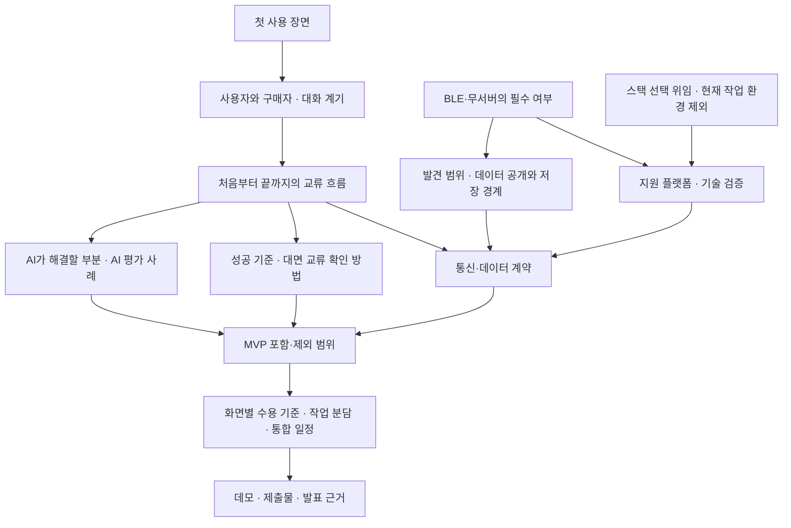

# 제품 구체화와 결정 기록

상태: **설계 인터뷰 1라운드 진행 중. 개발 착수 가능한 명세는 아직 아니다.**

## 근거와 확정 범위

- 사용자 요청: 주제는 교류이며 평가 요소를 중요하게 다룬다. 팀 개발용 저장소에 남길 문서를 만든다.
- 후속 지시: 스택 선택은 어시스턴트에게 위임한다. **현재 작업 환경에 설치된 도구·운영체제는 스택 선택 근거에서 제외한다.** 제품 요구와 해커톤 평가·시간 제약을 기준으로 비교한다.
- [팀 논의 원문](discussedw-raw.md): 초기 아이디어와 서로 다른 제안을 담은 자료다. 모든 문장을 합의된 요구사항으로 보지 않는다.
- [해커톤 제약](hackathon-brief.md): 제공된 이미지에서 확인한 배점과 제출·발표 조건이다.
- 논의 원문 안의 Notion 링크 본문은 이번 분석에 포함하지 않았다.
- 현재 작업 폴더에서 앱 코드나 패키지 설정은 발견되지 않았고, Git 저장소도 초기화되어 있지 않았다. 원격 저장소 연결 여부와 팀의 별도 작업은 미확인이다.

## 원문에서 읽히는 중심 가설

> 가까이 있는 사람의 현재 상태와 대화할 이유를 알면, 처음 말을 거는 부담이 줄어 대면 교류로 이어질 수 있다.

이것은 검증할 제품 가설이다. 실제 사용자가 원하는지, 상태를 공개할 의사가 있는지, 대화가 늘어나는지는 아직 관찰하지 않았다.

원문에는 상태 표현 → 주변 사람이 인지 → 대면 교류라는 흐름이 반복된다. ‘온라인에는 상태 메시지가 있는데, 현실에는 없다’는 문장은 출발점이 되는 비유다. 기존 제품이나 현실의 명찰·상태 표시 방식이 전혀 없다는 시장 조사 결과로 사용하지 않는다.

## 아직 갈리는 선택

| 쟁점 | 원문에 있는 방향 | 결정이 필요한 이유 |
| --- | --- | --- |
| 첫 사용처 | 일상·데이팅·학교·행사·해커톤 | 온보딩, 대화 계기, 사용 빈도, 구매자가 달라짐 |
| 서비스의 중심 | 상태를 보고 직접 대화 / 온라인 채팅 후 대면 | 핵심 사용자 흐름과 시연 완료 지점이 달라짐 |
| 데이터 경계 | 서버 없이 주변에만 공유 / 서버 프로필과 인증 / 행사만 서버 사용 | 개인정보 약속과 통신·저장 구조에 영향을 줌 |
| AI의 역할 | 자기소개 정리 / 관심사 추천 / 도움을 줄 수 있는 사람 알림 | AI 활용 점수를 뒷받침할 가치와 평가 방법이 달라짐 |
| 발견 범위 | 실제 근거리 / 같은 행사 방 / 같은 행사 내 원거리 | ‘근처’의 의미와 접근 가능한 대상이 달라짐 |
| 사용 방식 | 앱을 열어 사용 / 플로팅 아이콘과 상시 탐색 | 지원 플랫폼과 구현·배터리 제약을 먼저 검증해야 함 |
| 교류의 측정 | 운영진용 교류 수치 / 상태 노출과 반응 / 실제 대면 | 노출·추천·반응을 대면 교류 성과와 구분해야 함 |

## 1라운드: 독립적으로 답할 수 있는 질문

| ID | 질문 | 현재 제안 | 상태 |
| --- | --- | --- | --- |
| Q1 | 이번 MVP가 해결할 첫 사용 장면은? | 행사·밋업에서 혼자 온 참가자의 첫 대화 | 답변 대기 |
| Q2 | BLE와 서버 없음은 필수 원칙인가, 수단 후보인가? | BLE로 발견·상태 공유를 우선 검증하고 보조 기능의 서버 사용은 허용 | **확정.** QR=무리 필터, BLE=근접 판정. BLE는 프라이버시 근거(좌표 미전송). [protocol.md](../spec/protocol.md) 0번 |
| Q3 | 적절한 스택은 무엇인가? 팀 역할과 검증 기기는? | BLE 휴대폰 간 발견을 유지하는 안에는 Kotlin + Compose를 추천. 웹 대안은 Q2에 따라 비교 | 스택 선택 위임됨. 현재 작업 환경은 고려하지 않음. 역할·기기는 미확인 |

추천은 합의가 아니다. 사용자의 답변을 기록하고, 그 답변으로 결정 가능한 다음 질문을 정한다.

스택 선택 위임은 BLE·무서버의 필수 여부까지 확정한 답변은 아니다. 일반 웹을 제품 전체에서 제외하지 않는다. **휴대폰 간 BLE 자동 발견·직접 공유**와 **같은 행사·구역 참가자 사이의 서버 기반 상태 공유**는 서로 다른 제품 약속이므로 구분해 비교한다. 상세 근거는 [웹의 적용 범위](technical-findings.md#일반-웹의-적용-범위)에 기록한다.

## 결정의 의존 관계

기술 문서 조사와 실기기 검증은 구분한다. 지원 API가 존재한다는 사실만으로 현장 기기에서 안정적으로 동작한다고 보지 않는다. [BLE 조사와 검증 후보](technical-findings.md)에 공식 문서 근거와 첫 검증안을 기록했다.

## 다음 라운드에서 검증할 구체적 상황

아래는 질문 후보이며, 현재 미결정된 선택에 따라 수정한다.

- 대화 가능 상태만 보고 바로 다가가도 되는가, 짧은 요청과 수락이 필요한가?
- 앱에서 발견한 닉네임이 현실의 누구인지 어떻게 알아보는가?
- 같은 관심사가 있지만 집중 중인 사람과, 관심사는 다르지만 도움을 줄 수 있는 사람 중 누구를 추천하는가?
- 상태를 바꾸거나 자리를 떠난 사람을 계속 표시하지 않으려면 어떤 약속이 필요한가?
- 주변 사용자가 0명이거나 상대가 반응하지 않을 때 사용자는 무엇을 할 수 있는가?
- AI가 근거 없이 상대의 전문성을 추정하거나 추천에 실패하면 어떻게 처리하는가?
- ‘실제 교류 1회’를 어떤 행위로 확인하며, 단순 버튼 클릭과 어떻게 구분해 발표하는가?
- 서버 없는 공유를 선택하면서 AI 호출이나 운영진 통계를 제공한다면 어떤 데이터만 외부로 나가는가?

## 개발 착수 가능한 상태의 기준

| 필요한 결과 | 완료 판단 | 현재 상태 |
| --- | --- | --- |
| 제품 정의 | 대상 사용자·문제·핵심 가치가 한 문장으로 합의됨 | 미정 |
| 핵심 흐름 | 두 사용자의 시작·응답·대면 전환·종료 행동이 정해짐 | 미정 |
| MVP 경계 | 필수 기능과 이번에 구현하지 않을 기능을 구분함 | 미정 |
| AI 역할 | 입력·출력·가치·평가 예시·실패 시 동작이 정해짐 | 미정 |
| 기술과 데이터 | 플랫폼·전송 방식·공개 범위·수명·데이터 계약이 정해짐 | 문서 조사 완료, 결정·실기기 검증 대기 |
| 팀 작업 | 담당자·선후 관계·공유 인터페이스·완료 조건이 정해짐 | 미정 |
| 검증과 발표 | 실기기 검증 기준·데모 순서·배점별 증거·제출 준비가 정해짐 | 제약 확인 |

합의한 제품·구현 사양은 이 문서에 반영한다. 분량이 늘어 화면 명세나 통신 계약을 별도 문서로 분리할 때는 이 문서에서 연결하고, 동일한 결정을 여러 파일에서 따로 관리하지 않는다.

되돌리기 어렵고 실제 대안을 비교한 구조적 선택이 생기면 ADR을 작성한다. 현재는 해당 선택이 확정되지 않아 ADR을 만들지 않았다.
