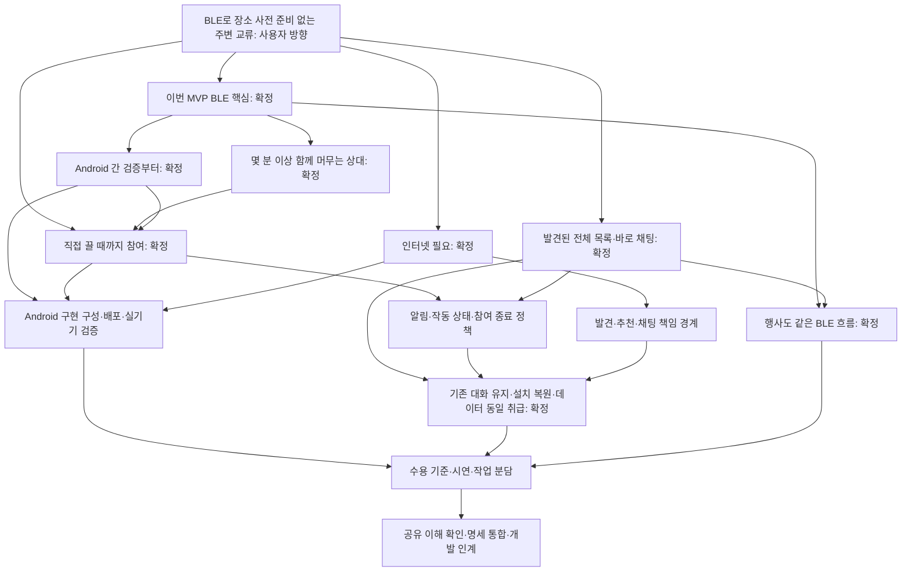

# BLE 근접 교류 전환: 확정 결정과 변경 이력

상태: **2026-09-20 갱신, 방향 전환 인터뷰 완료·사용자 최종 확인. 이번 MVP는 Android 사용자 간 BLE 발견을 핵심 흐름으로 삼고, 몇 분 이상 함께 머무는 사람을 중심으로 검증하며 인터넷 연결이 필요하다. 지속 ON·발견된 참여자 전체 목록·별도 수락 없는 바로 채팅을 채택했다. 거리 이탈·발견 OFF 뒤 기존 대화를 유지하며 행사에서도 같은 흐름을 쓴다. 회원가입 없이 같은 앱 설치에서 정보를 복원한다. 백그라운드 자동 추천 알림을 이번 MVP에 포함하고 실제 문제가 발생하면 재검토한다. 시연 데이터도 같은 정책으로 취급한다. 제품 흐름과 문서 통합 결과를 사용자가 최종 확인했다.** 이 문서가 전환 논의의 진입점이다. 기존 행사 명세나 초기 BLE 설계를 새 요구사항으로 자동 적용하지 않는다. 이번 작업은 문서 확정과 PR 작성이며 제품 코드는 변경하지 않는다.

## 사용자가 정한 방향

- 사용자는 BLE를 이용해 사전에 정해진 행사·장소에 종속되지 않고 주변 사람과 교류하는 방향을 선택했다.
- 큰 변경에 맞춰 문서를 철저히 정리하고, 번복된 과거 결정이 현재 기준과 충돌하지 않도록 정리하도록 요청했다.
- **B1 사용자 결정: 이번 MVP부터 BLE를 핵심 흐름으로 가져간다.** 행사 QR MVP를 먼저 완료하고 다음 버전에서 BLE를 도입하는 계획은 채택하지 않는다.
- **B3 사용자 결정: 인터넷 연결은 필요하다.** 무서버·완전 오프라인 동작을 필수로 하지 않는다. BLE 발견 이외의 상세 전송 책임은 아직 기술 설계 대상이다.
- **B2 사용자 결정: 직접 끌 때까지 발견 참여를 유지하는 추천안을 채택한다.** 앱을 보지 않을 때도 저전력 발견을 시도하는 방향이다. 사용자는 배터리 최적화·장시간 성능 문제를 해커톤 이후 논의로 미뤘다. 8시간 배터리 측정·소모 목표를 이번 완료 조건이나 추가 질문의 선결 조건으로 두지 않는다. 실제 BLE 발견과 시연에서 지원한다고 설명하는 동작의 확인은 유지한다.
- **B4 사용자 결정: 이번 MVP는 몇 분 이상 같은 공간에 머무는 사람을 중심으로 검증한다.** 몇 초 스쳐 가는 사람까지 놓치지 않는 것을 이번 필수 성공 조건으로 두지 않는다. 고정 최소 체류 시간·발견 지연 수치를 확정한 것은 아니다.
- **B5 사용자 결정: Android 사용자 간 검증부터 시작한다.** iPhone·교차 OS는 후속 검증 단계로 두고 이번 필수 지원 범위에 넣지 않는다. 구체적인 프레임워크·최소 OS·배포 방식이나 기존 Android/GATT 초안 전체를 채택한 것은 아니다.
- **B6 사용자 결정: 유효하게 발견된 참여자 전체를 추천 순서로 보여준다.** 낮은 추천 평가만으로 목록에서 제거하지 않는다. 자기소개·교류 의도는 상세에서 공개하며, 자동 알림의 대상 조건은 별도다.
- **B7 당시 결정은 B13으로 대체:** 요청·수락 모델을 폐기하고 바로 채팅한다. 답장과 대화 지속 여부는 수신자가 결정한다.
- **B8 유지·B13 반영:** 거리 이탈·발견 OFF 뒤에도 이미 시작한 대화·이력·송수신을 유지한다. 발견 OFF는 새 발견·새 상대와의 대화 시작을 중단한다. 연락 중단과 발견 OFF를 구분하되 B13에서 제안한 차단 세부 규칙을 승인한 것으로 보지 않는다.
- **B9 요청 정책은 B13으로 적용 종료:** 요청 객체 자체가 없다. 첫 메시지로 시작된 대화와 받은 메시지는 거리 이탈·발견 OFF 뒤에도 유지한다.
- **B11 사용자 결정: 별도 회원가입 없이 시작하고 같은 앱 설치에서 소개·대화를 복원한다.** 앱 종료·재실행은 같은 사용자로 이어지며, 삭제·재설치나 다른 기기에서의 복원은 이번 범위에서 제외한다.
- **B10 사용자 결정: 행사에서도 같은 BLE 흐름을 사용한다.** 별도 행사 방·QR 입장·운영자 일괄 종료를 이번 MVP에서 제외한다. 행사 전체 참가자 탐지를 보장하지 않는다.

- **B12 사용자 결정(2026-09-20): 백그라운드 자동 추천 알림을 일단 이번 MVP에 포함하고, 문제가 발생하면 그때 재검토한다.** 구현 전 우려만으로 제외하지 않는다. 실제 실패가 확인되면 조건·원인과 대안을 기록하며 기능을 검증 완료로 표시하거나 조용히 제거하지 않는다.

- **B13 사용자 결정(2026-09-20): 그냥 바로 채팅하고 사용자가 알아서 결정한다.** 별도 요청·수락·거절·재요청 게이트를 구현하지 않는다.
- **B14 사용자 결정(2026-09-20): 시연 데이터도 일반 데이터와 동일하게 취급한다.** 별도 시연 종료 일괄 삭제 정책을 두지 않는다.

‘장소에 종속되지 않는다’는 **운영자가 행사 방이나 QR을 준비하지 않은 곳에서도 주변 교류를 시작할 수 있다는 방향**으로 해석한다. 상대 사용자의 참여, 권한, 기기 지원, 실제 전파 도달 조건이 없어도 작동한다는 뜻은 아니다. 인터넷은 필요하다.

## 남은 구현 구체화와 확인 경계

제품 질문 B1~B14는 아래 최종 변경을 반영해 정리했다. 엔드포인트·관측 유예·중복 방지는 [API v0.1](api-contract.md)로 확정했으며 구현 예정이다. 남은 BLE 광고 배치·Android 인증 저장·SDK 버전·알림 전송 경로·AI 추천 기준은 기존 기술/AI 위임에 따라 개발 계약으로 구체화한다. 수치를 사용자 결정이나 실측값으로 꾸미지 않는다.

별도 수락·요청 거절·시연 전용 삭제를 다시 선결 질문으로 되살리지 않는다. 장기 배터리 최적화·운영 보관 정책·재설치 복원·부가 채팅 기능은 이번 핵심 흐름에 추가하지 않는다. 데이터의 시간 기반 자동 삭제는 현재 MVP에 추가하지 않는 개발 기본값으로 두며, B14 자체가 영구 보관을 보장한 것은 아니다.

2026-09-20 사용자가 “맞아. 마무리해. 그리고 현재 main 고려해서 PR 생성해.”라고 답해 최종 공유 이해를 확인하고 문서 PR 작성을 요청했다. 이 문서화 요청은 구현·배포·데이터 삭제를 수행했다는 뜻이 아니다.

기존 Q8의 자기소개·교류 의도 구분, Q9/AI-Q1의 양쪽 의도 고려, AI-Q3의 Promptfoo 선택처럼 이번 변경과 직접 충돌하지 않는 결정은 보존한다. 기존 선택을 전부 미정으로 되돌리지 않는다. 행사 소속에 결합된 정책만 새 맥락에서 재검토한다.

> **이력 읽기:** 아래 라운드는 당시 질문·답변 기록이다. B7의 요청·수락과 B9의 요청 수명은 B13으로 대체됐다. 현재 기준은 위 요약과 [ADR-0005](adr/0005-direct-chat-uniform-data.md)다.

## 라운드 1 — 선행 결정을 기다리지 않고 물을 수 있는 질문

모든 추천은 어시스턴트의 제안이며 사용자 답변이 아니다.

| ID | 사용자 결정이 필요한 질문 | 추천 | 상태 |
| --- | --- | --- | --- |
| B1 | 이번 제출·구현부터 BLE 발견을 핵심 경로로 바꿀지, 기존 행사 MVP를 먼저 완료하고 후속 버전에 적용할지? | 이번 MVP부터 BLE 발견을 핵심으로 검증 | **사용자 결정: 이번 MVP부터 BLE 핵심 흐름** |
| B2 | 발견 가능 상태를 어떻게 시작하고 끝낼지: 사용자가 기간을 정해 켜기 / 한 번 동의한 뒤 끌 때까지 지속 / 앱 사용 중만? | 당초 기간 지정 제안. 조사 후 지속 동의와 실제 탐색 강도를 분리하는 방향 검토 | **조사 후 라운드 3에서 지속 ON 채택. 장시간 배터리·최적화 논의는 해커톤 이후** |
| B3 | 인터넷 연결이 필요한 서비스여도 되는지, 인터넷 없이도 교류해야 하는지? | BLE 근접 발견 + 서버 추천·채팅 구성 제안 | **사용자 결정: 인터넷 필요. 세부 책임은 기술 설계 대상** |

변경 근거는 [ADR-0001](adr/0001-ble-discovery-mvp.md), B2 조사 결과는 [지속 BLE 발견의 비용과 제약](../research/tech/ble-always-on.md)을 따른다. 해당 조사는 실기기 측정 결과가 아니며 제안 수치를 승인된 성능으로 인용하지 않는다.

## 라운드 2 — 조사 후 결정할 제품 조건

B2 조사에서는 지속적인 참여 의사와 높은 강도의 연속 스캔을 분리할 수 있다는 점을 확인했다. 그러나 절전 상태에서 허용할 발견 지연과 필수 지원 OS에 따라 실현 가능한 경험이 달라진다. 따라서 지속 ON을 확정하기 전에 아래 두 조건을 묻는다. 플랫폼·라이브러리 선택 자체를 다시 사용자에게 위임하는 질문은 아니다.

| ID | 질문 | 추천 | 상태 |
| --- | --- | --- | --- |
| B4 | 몇 초 스쳐 가는 사람을 놓치지 않는 것이 핵심인지, 몇 분 이상 함께 머무는 사람을 발견하는 것으로 시작해도 되는지? | 이번 MVP는 몇 분 이상 함께 머무는 상대를 중심으로 검증. 허용 지연·성공률 수치는 지원 조합 검증과 함께 결정 | **사용자 결정: 추천안 채택** |
| B5 | 이번 MVP에서 iPhone과 Android 사이의 교류도 필수인지, Android 사용자 간 검증부터 시작할 수 있는지? | Android 간 검증부터 시작하고 iPhone·교차 OS를 별도 검증 단계로 두는 안. 현재 개발 환경 때문이 아니라 화면 꺼짐·광고 호환성 제약 때문 | **사용자 결정: 추천안 채택** |

조사 당시에는 지속 ON + 저전력 배경 탐색 + 사용자 요청 시 적극 탐색 + 변경 기반 LLM 평가를 권고했다. 이후 라운드 3에서 지속 ON을 채택했다. 별도 적극 탐색 버튼·구체 캐시 전략 전체나 실기기 성공을 승인한 것은 아니다. B4/B5의 선택 이유·대안은 [ADR-0002](adr/0002-android-dwell-mvp.md)에 기록한다.

## 라운드 3 — 발견 참여와 공개·첫 연락

B4/B5가 정해져 B2를 다시 결정할 수 있다. B6/B7은 **두 사람 모두 발견 참여를 켰고 유효하게 발견된 경우**를 전제로 묻는다. 공개·첫 연락의 기본 정책은 참여 허용 기간과 독립적으로 선택할 수 있다. 끄기·이탈 이후의 수명과 연락 정책은 이 라운드 답변 뒤에 묻는다.

| ID | 질문 | 추천 | 상태 |
| --- | --- | --- | --- |
| B2 재개 | 직접 끌 때까지 발견 참여 의사를 유지하고, 앱을 보지 않을 때도 저전력으로 발견을 시도하는 방식을 채택할지? | 지속 ON을 채택하되 실제 작동·지연·권한 상태와 참여 설정을 구분. 항상 최고 강도 탐색하거나 즉시 발견을 보장하지 않음 | **사용자 결정: 추천안 채택. 배터리 최적화·장시간 성능은 해커톤 이후** |
| B6 | 발견 참여자 전체를 추천 순서로 볼지, AI가 선정한 상대만 공개할지? | 유효하게 발견된 참여자 전체를 목록에 남기고 추천 순서로 정렬. 자기소개·의도는 기존처럼 상세에서 공개. 추천 알림 발송 조건은 후속 결정 | **사용자 결정: 추천안 채택** |
| B7 | 처음 연락할 때 바로 채팅할지, 첫 메시지를 대화 요청으로 보내고 수락 후 계속 대화할지? | 첫 메시지를 포함한 대화 요청 후 수락. 미수락 상태의 연속 메시지를 허용하지 않는 방향. 기존 행사 Q11을 새 환경에 자동 적용하지 않음 | **당시 채택, 이후 B13으로 대체** |

B7로 기존 Q11의 바로 채팅을 새 MVP에서는 요청·수락 흐름으로 대체했다([ADR-0003](adr/0003-conversation-request.md)). B6은 기존 Q9의 의도 불일치에 따른 정렬 원칙을 근접 발견된 참여자 목록에 적용하는 것으로 확정했다.

## 라운드 4 — 발견 이후의 관계와 행사 사용

사용자는 B8·B9·B10 추천안을 모두 채택했다. 거리 이탈·발견 OFF·행사 종료를 기존 관계의 삭제나 연락 종료로 간주하지 않는다.

| ID | 질문 | 추천 | 상태 |
| --- | --- | --- | --- |
| B8 | 이미 수락한 대화를 상대가 멀어지거나 발견 참여를 꺼도 이어갈지? | 기존 대화·이력을 유지하고 송수신을 허용. 발견 OFF는 새 발견·새 요청을 중단하는 의미로 한정하고 기존 상대의 연락 중단은 차단으로 분리 | **사용자 결정: 추천안 채택** |
| B9 | 수락 전 받은 요청은 상대가 멀어지거나 발견 참여를 꺼도 열람·수락할 수 있을지? | 이미 도착한 요청은 열람·수락 가능. 새로운 요청은 현재 발견·참여 조건을 충족할 때만 허용. 거절·취소·만료 등 세부 상태는 후속 계약에서 정리 | **당시 채택, 요청 모델은 B13으로 적용 종료** |
| B10 | 행사에서 별도 QR·행사 방을 유지할지, 같은 BLE 흐름으로 사용할지? | 이번 MVP는 행사에서도 같은 BLE 흐름을 사용. 별도 행사 방·QR 입장·운영자 일괄 종료는 제외. 행사 전체가 탐지 범위에 포함된다는 보장은 하지 않음 | **사용자 결정: 추천안 채택** |

B8~B10으로 행사 소속·종료 기반 수명 정책을 폐기하고, 발견과 기존 관계의 수명을 분리한다([ADR-0004](adr/0004-discovery-and-relationships.md)). 실제 데이터 삭제 주기는 별도의 보관 정책이며, 이번 결정이 영구 보관이나 재설치 복원을 보장한다는 뜻은 아니다.

## 라운드 5 — 재사용과 자동 알림

| ID | 질문 | 추천 | 상태 |
| --- | --- | --- | --- |
| B11 | 첫 실행에 별도 회원가입 없이 시작하고 같은 설치에서 소개·요청·대화를 복원할지, 계정 로그인과 기기 간 복원까지 포함할지? | 이번 MVP는 별도 회원가입 없이 같은 설치에서 복원. 앱 재설치·다른 기기 복원은 제외. 기존 같은 브라우저 복원은 Android 설치 단위로 전환 | **사용자 결정: 추천안 채택** |
| B12 | 이번 MVP에서도 앱 밖에서 잘 맞는 새 상대를 자동 알림할지, 이번에는 앱 안의 추천 목록으로만 시연할지? | 앱을 보지 않을 때도 추천 알림을 제공하는 것을 핵심 흐름에 포함. 모든 발견마다 알리지 않고 적합한 새 상대만 중복 억제하여 알림. 판정 기준은 AI/기술 계약에서 정함 | **사용자 결정(2026-09-20): 일단 포함, 문제 발생 시 재검토** |

B12 기술 확인: 선택한 Capacitor Android 구성에서 Kotlin 네이티브 계층이 BLE 발견·서버 보고·알림을 처리하는 구현 경로가 있다. 현재 저장소에는 해당 계층이 아직 구현되지 않았다. React 화면의 지속 실행이나 웹 SSE에 배경 동작을 의존하지 않는다. 조건·알림 경로·시연 범위는 [Android 설계](android-design.md#백그라운드-발견부터-추천-알림까지)에 기록한다. 사용자는 기술 설명을 받은 뒤 B12를 채택했다. 실기기 검증 완료를 뜻하지 않는다.

B12는 이전 Q12에서 보류한 부가 채팅 알림의 상세 설계를 재질문하는 것이 아니라, 새 제품의 핵심인 자동 추천 알림이 이번 MVP에 필요한지 확인하는 질문이다. 채팅 읽음·파일·사진 등 보류 기능을 되살리지 않는다. 요청 관련 정책은 이후 B13에서 요청 모델 자체를 폐기하며 정리했고, 시연 데이터는 B14에 따라 일반 데이터와 동일하게 취급한다.

## 라운드 6 — 요청 종료·차단과 이번 데이터 보관

사용자는 아래 추천 대신 바로 채팅과 동일 데이터 취급을 선택했다. 제안했던 거절·차단 세부 정책이나 시연 전용 삭제를 채택하지 않는다.

| ID | 질문 | 추천 | 상태 |
| --- | --- | --- | --- |
| B13 | 거절·차단 후 상대와의 관계를 어떻게 처리할지? | 거절은 해당 요청 종료, 같은 발신자의 재요청은 이번 MVP에서 미지원. 차단은 서로의 주변 목록·추천 알림·새 요청·새 메시지를 막고 기존 대화는 읽기 전용으로 유지. 차단 해제·요청 취소·자동 만료는 후속 범위 | **사용자 변경: 별도 수락 없이 바로 채팅, 사용자가 답장·지속 여부 결정** |
| B14 | 이번 MVP의 요청·대화를 언제까지 보관하고 삭제할지? | 테스트·시연 기간에는 자동 만료 없이 유지하고, 검증 종료 후 시연 데이터를 별도 운영 절차로 일괄 삭제. 장기 보관 기간·사용자별 삭제 화면은 후속 설계. 근접 이탈·발견 OFF·행사 종료에 연결하지 않음 | **사용자 변경: 시연 데이터도 일반 데이터와 동일하게 취급** |

B13으로 요청·수락 모델과 관련 상태를 제거한다. B14로 시연 전용 삭제안을 제거한다. 변경 이유와 대체 범위는 [ADR-0005](adr/0005-direct-chat-uniform-data.md)에 기록한다. 데이터 삭제를 실제 실행하지 않는다.

## 위임받은 구현 구성

B8의 대화 유지와 B13의 바로 채팅에 따라 발견과 기존 관계가 분리되므로 BLE는 발견·최소 신원 연결에, 서버는 추천·채팅에 사용한다. 기술 선택 위임에 따라 기존 React/Vite UI를 Capacitor Android 셸로 재사용하고 Kotlin에서 BLE 수명주기를 관리하는 구성을 개발 출발점으로 선택했다. FastAPI·Redis 기반은 재사용하되 행사별 데이터 계약은 대체한다. 사용자 선택으로 꾸미지 않고 [기술 근거](android-design.md)와 [행동 계약](development-contract.md)에 구분해 기록한다. 아직 구현 착수나 실기기 검증 완료를 뜻하지 않는다.

## 설계 의존 관계

후속 질문은 선행 답변과 기술 조사 결과가 나온 뒤 구성한다. 사용자가 환경에서 확인할 수 있는 기술 사실을 대신 조사하도록 요구하지 않는다. 기존 스택 선택 위임과 현재 작업 환경을 선택 근거에서 제외한다는 지시는 유지한다.

## 문서 정리와 충돌 처리

1. 현재 전환 상태는 이 문서에서 관리한다. 기존 문서 상단의 전환 안내가 본문 속 ‘현재·확정·개발 기준’ 표기보다 우선한다.
2. 과거 사용자 답변과 기술 검토를 삭제하거나 새 답변처럼 고치지 않는다. 이후 승인된 대체 정책과 연결하여 이전 결정의 적용 범위를 남긴다.
3. 새 정책이 정해지면 제품 요약·개발 계약·API·화면·검증·팀 계획·발표를 함께 갱신한다. 상단 안내만 붙인 상태를 최종 정리 완료로 간주하지 않는다.
4. `CONTEXT.md`는 확정된 용어만 기록한다. 설계 제안·기술 사양·작업 상태는 넣지 않는다. 현재의 행사 관련 용어를 일상 사용자에게 그대로 확대 적용하지 않는다.
5. 새로운 구조·경계의 선택이 확정되면 ADR에 대안과 선택 이유를 남긴다. 오래된 Android BLE/GATT 설계를 재채택한 것으로 간주하지 않는다.

| 문서군 | 충돌 또는 정리할 내용 | 현재 처리 / 후속 작업 |
| --- | --- | --- |
| README, spec/MASTER, spec/PRD | 행사 전용·수락 게이트의 소개 | **B1~B14 현재 기준으로 통합 완료** |
| CONTEXT | 행사 용어·요청/수락 정의 | **현재 근접 발견·바로 채팅 용어만 유지, 행사 용어는 이력 보관** |
| docs/planning, spec/prompts | 과거 Q1~Q20와 AI 후속 결정 | **과거 원문 이력 보존, AI 후속 결정·Promptfoo는 현행 문서에 유지** |
| docs/development-contract, docs/api-contract, spec/protocol | 방별·요청/수락·종료 계약 | **바로 채팅·설치 인증·근접 관측·기존 대화 유지로 통합** |
| spec/design, spec/frontend-plan, spec/scenario | QR·요청함·행사 종료 화면 | **Android 발견→추천→바로 채팅→복원으로 통합** |
| docs/validation, docs/team-plan, spec/roadmap | 이전 검증·순서·작업 경계 | **BLE 검증·Android 역할·자동 추천 알림을 포함한 새 계획** |
| docs/technical-findings, docs/ble-design | 과거 웹/무서버/GATT 선택 | **최신 조사·Android 설계 진입점으로 교체, 초안은 이력 보관** |
| pitch/script | 무저장·5분 소멸·QR 시연 | **실제 Android 검증 기반 발표 흐름으로 교체** |
| docs/deployment, server/docs/redis, 실행 README | 같은 출처·브라우저·행사 키/삭제 | **APK/HTTPS 경계·설치 복원·동일 데이터 정책으로 갱신** |
| docs/topic-evaluation, research | 과거 시장·제품 가설 | **현행 제품과 조사/가설 구분. 연구를 요구로 자동 승격하지 않음** |
| docs/history, docs/reviews, docs/discussedw-raw, docs/hackathon-brief | 과거 명세·관찰·원본 | **이력/외부 근거로 보존, 현재 사양과 분리** |

## 기록 범위

이번 작업 시작 전부터 수정 중이던 `docs/planning.md`, `research/README.md`, `spec/prompts.md`, `skills-lock.json` 등의 변경은 덮어쓰지 않는다. 문서 전환은 구현·시연 성공을 뜻하지 않는다. 현재 코드와 문서의 일치 여부는 별도 점검 결과로 기록한다.

2026-09-19 당시 코드 확인(현재 main의 구현 설명이 아님): `server/app/main.py`에는 health 라우터만 등록되어 있고, `web/src/api/client.js`의 제품 API는 미구현이며 기본 경로는 mock이다. `web/src/state.jsx`의 `bleConnected: true`와 `web/src/lib/bleChat.js`는 실제 BLE 발견의 증거가 아니다. 새 BLE 기능·추천·두 사용자 통신이 구현되어 있다고 소개하지 않는다.

2026-09-19 B1·B3 후속: ADR-0001과 지속 발견 조사 문서를 작성하고 README·MASTER·PRD 본문을 새 방향으로 통합했다. 이전 세 문서는 상대 링크를 조정해 이력 경로로 보존했다. 문서 링크와 diff 공백 검사를 수행했으며 앱 코드·제품 동작 테스트는 이번 문서 조사 작업의 결과가 아니다. API·화면·데이터 수명 등 후속 결정이 필요한 명세의 전체 통합은 아직 완료되지 않았다.

2026-09-20 B13/B14 후속: 요청·수락 ADR을 폐기하고 바로 채팅·동일 데이터 취급을 ADR-0005로 기록했다. 이전 행사 문서 18개를 추가 보관하고 활성 개발/API/화면/팀/검증/배포/발표 문서를 통합했다. 삭제한 것은 사용자 데이터가 아니라 현행 문서의 폐기된 요구사항이며 원문은 이력으로 보존했다. 코드·설치·배포·실기기 테스트는 수행하지 않았다.

2026-09-20 최종 확인·main 통합: 사용자가 최종 흐름을 확인하여 인터뷰를 마쳤다. PR은 최신 main `16349c7`에서 분기했다. main의 새 프론트 HTTP/SSE·데모·회귀 테스트·빌드 구분을 보존하고 현재 구현 설명을 갱신했다. 새로 들어온 발표 덱·대본·PDF/PPTX는 이전 행사 계약 기준임을 표시했다. 제품 코드는 이번 PR에서 변경하지 않는다.
