# Bside 모바일 UI 개선 — Before / After

중복된 내 소개 카드와 안내를 줄이고, Android 뒤로가기와 시스템 영역 겹침을 고쳤다. 발견 ON/OFF는 **주변 교류 참여** 스위치로 유지한다. 기존 대화가 발견 참여와 무관하게 이어지는 정책은 유지한다.

## 실기기 비교

같은 SM-S937N, Android 16, 1080×2340, 글자 크기 1.0에서 무선 ADB로 캡처했다. WebView는 384×832 CSS px다. PNG는 보정·합성하지 않은 기기 캡처이며, 아래 표에서만 표시 크기를 줄였다.

Before의 주변 목록·상세는 같은 날 선행 UI 리뷰에서 저장한 화면이고, 나머지는 수정 직전 다시 캡처했다. After는 수정한 APK를 설치한 뒤 동일한 프로필과 기존 대화로 촬영했다. 캡처 시각·시스템 알림 아이콘은 다르다. 추천 완료·기존 대화·발견 OFF 등 비교하는 앱 상태는 맞췄다.

### 주변 목록

내 소개 카드를 제거하고 편집 진입을 상단의 ‘내 정보’로 모았다. 참여 스위치는 한 줄로 줄이고, 상대 카드에 나누고 싶은 이야기를 추가했다. 검색 대상에도 교류 의도를 포함한다.

첫 상대 카드의 상단 위치는 **577.7 → 408.3px**로 약 169px 올라왔다. 이는 해당 기기와 캡처 내용의 측정값이다.

| Before | After |
| --- | --- |
| 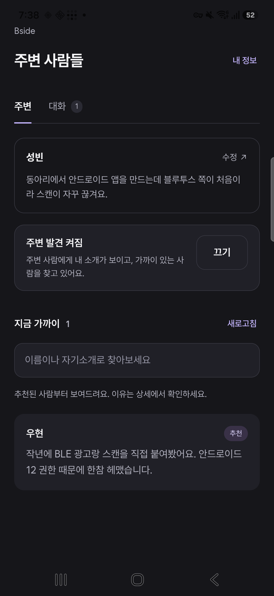 | 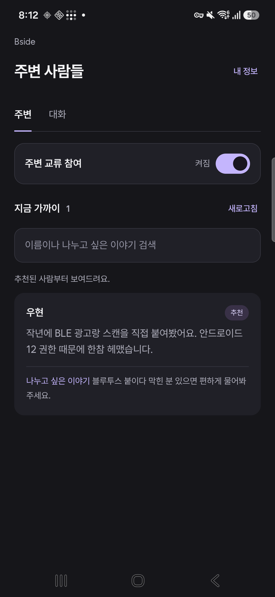 |

### 발견 OFF

중복 켜기 버튼과 검색·추천 안내를 없앴다. 참여를 켜기 전에 소개 공개 범위와 백그라운드 참여 지속을 설명한다. 참여를 끈 상태에서도 기존 대화를 이어갈 수 있음을 표시한다.

| Before | After |
| --- | --- |
| 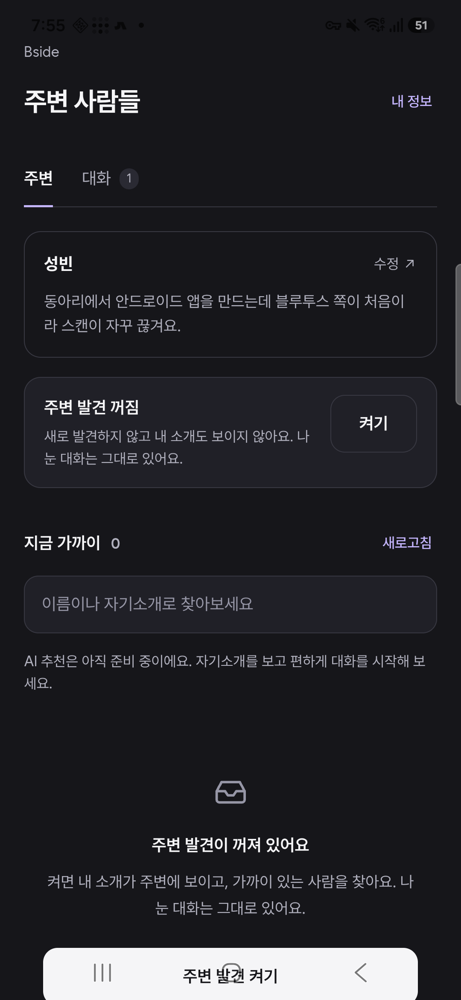 | 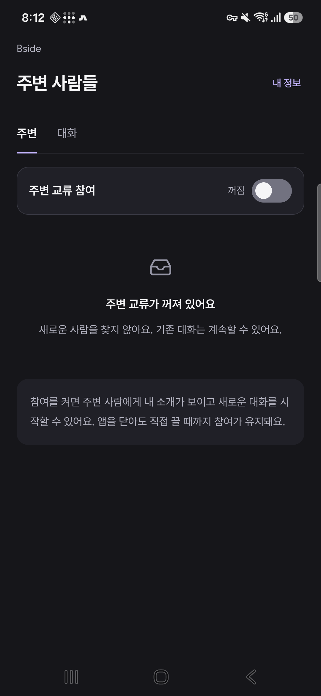 |

### 채팅과 키보드

상단 안전 영역을 적용하고 어두운 배경에 맞는 상태바 아이콘을 설정했다. 입력창은 내용에 따라 늘어나며 최대 140px 이후 내부 스크롤을 사용한다. Enter는 줄바꿈, 전송은 보내기 버튼으로 구분한다. 글자 수는 1,800자부터 표시한다.

| Before | After |
| --- | --- |
| 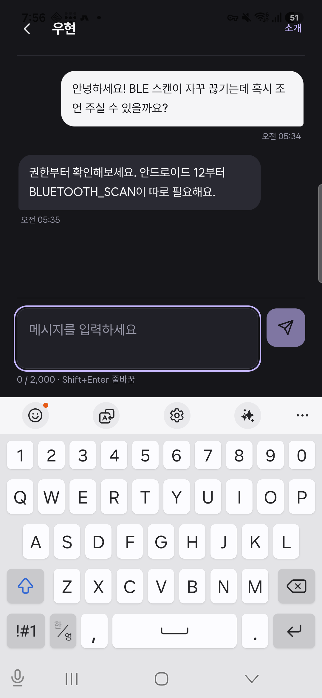 | 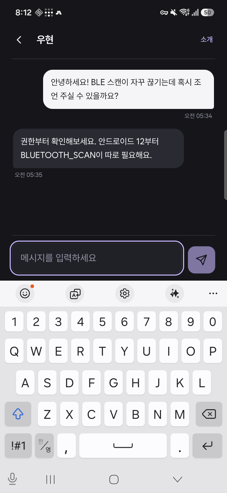 |
| 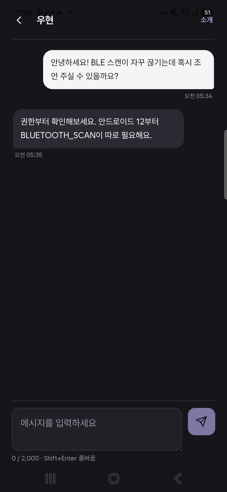 | 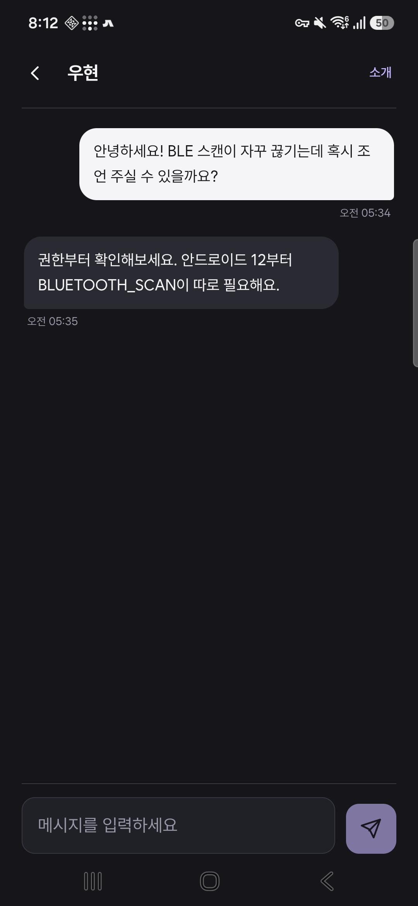 |

### 대화 목록 — 내 발견 OFF

내 관측이 중단된 것을 상대의 이탈로 단정하던 ‘주변에 없음’을 제거했다. 현재 관측된 상대에게만 ‘지금 주변’을 표시한다. 전체 대화 수를 표시하던 탭 배지를 없애고 최근 메시지 시간을 추가했다.

| Before | After |
| --- | --- |
| 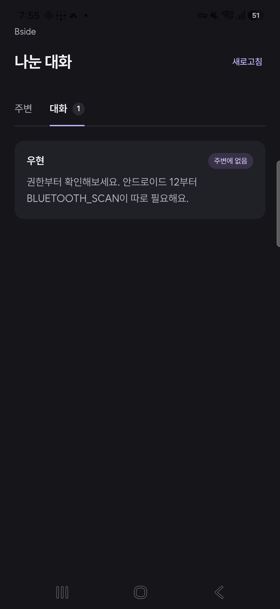 | 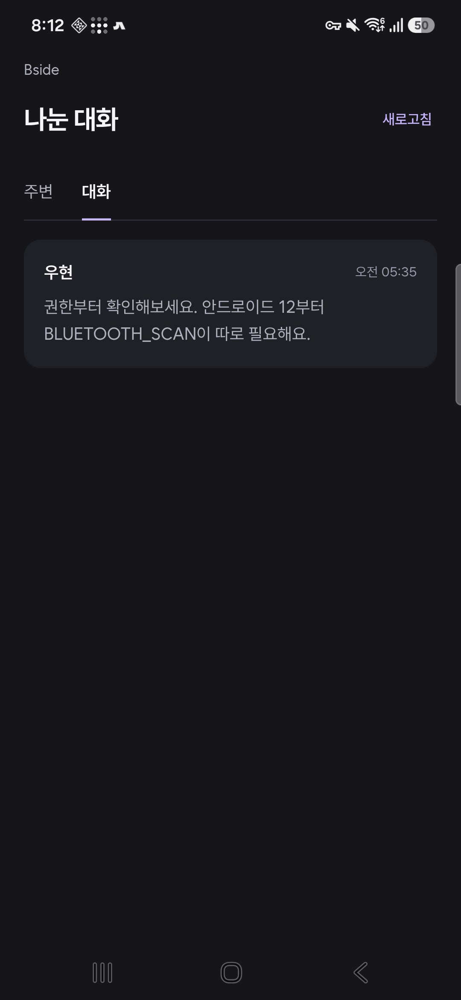 |

### 상대 소개

채팅에서 소개를 연 뒤 돌아가면 원래 대화와 초안을 복원한다. 추천은 완료·평가 중·연결점 부족·사용 불가를 구분한다. 관측된 소개가 없으면 확인 불가라고 안내하며, 별도 프로필 조회 API나 공개 범위를 추가하지 않는다.

| Before | After |
| --- | --- |
| 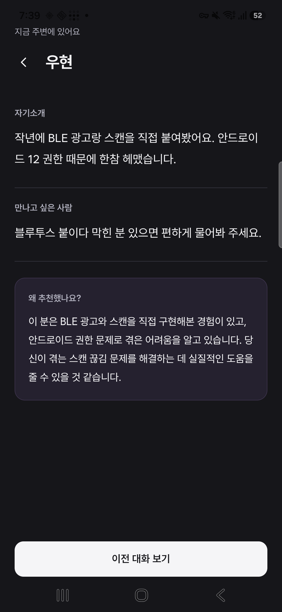 | 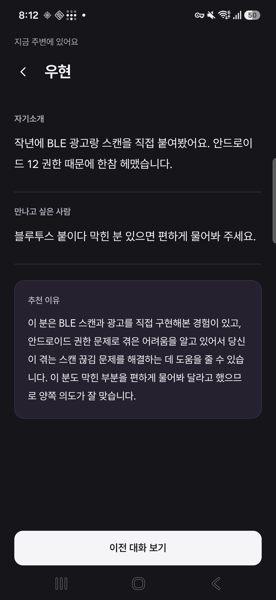 |
| 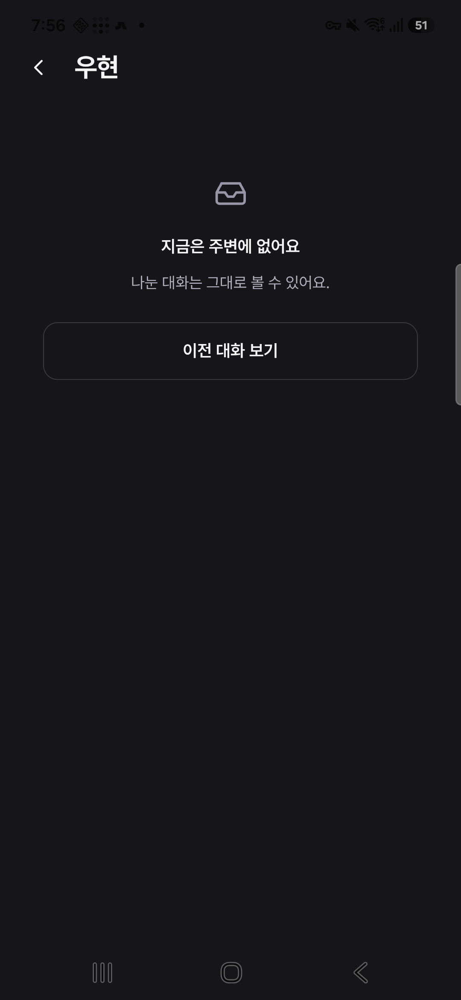 | 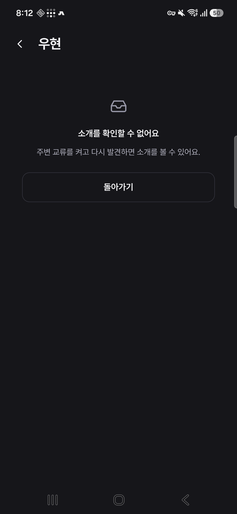 |

### 내 정보

시스템 영역과의 간격을 통일했다. Android 뒤로가기와 화면의 뒤로가기 모두 이전 화면으로 돌아간다.

| Before | After |
| --- | --- |
| 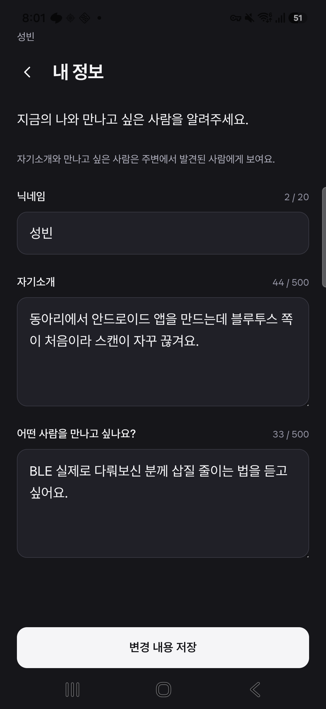 | 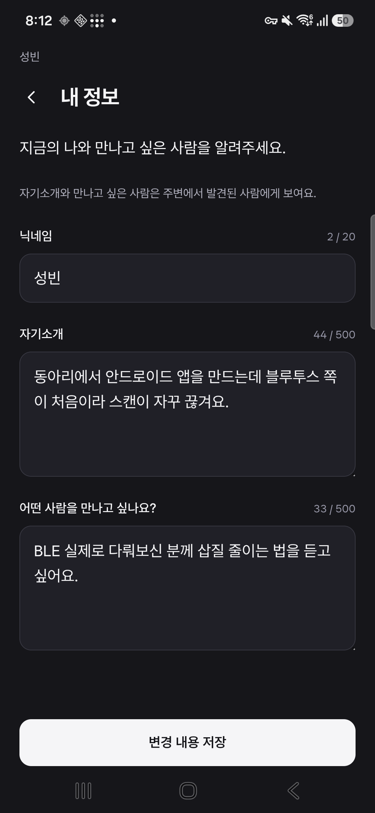 |

## 검증

| 범위 | 결과 |
| --- | --- |
| 린트·자동 테스트 | `npm run lint`, `npm test` — 59개 통과. 탐색 이력 회귀 테스트 4개 포함 |
| 프로덕션 빌드 | `VITE_API_BASE=https://bside-api.sungblab.com npm run build`, `npx cap sync android` 통과 |
| Android 빌드 | JDK 21, `bash gradlew :app:assembleDebug -Pbside.apiBaseUrl=https://bside-api.sungblab.com` 통과 |
| 실기기 시스템 뒤로가기 | 내 정보·상세에서 복귀, 채팅에서는 키보드부터 닫힘, 주변 루트에서는 앱 최소화 |
| 실기기 참여 상태 | OFF에서 네이티브 발견 중단, ON에서 재개, 루트 최소화 뒤 서비스 실행 유지 |
| 실기기 채팅 | 기존 메시지 2개 유지, Enter로 줄바꿈, 새 메시지는 전송되지 않음 |
| 실기기 소개 복귀 | 채팅 → 소개 → 뒤로가기 시 같은 채팅과 미전송 초안 복원 |
| 실기기 안전 영역 | 채팅 뒤로가기 버튼 상단 45px. 키보드 높이 반영 후 가용 높이 473.6px에서 입력창·전송 버튼 하단 461.6px |
| 실기기 검색 | 상대 교류 의도의 ‘블루투스’로 검색 성공 |
| 브라우저 보완 검증 | 320·384·480px 가로 넘침 없음, 검색 결과 0건 후 검색 지우기, 입력창 확장, 2,000자 초과 전송 비활성화 |
| 추천 분기 | 브라우저 상태 fixture로 ready·pending·unscored·unavailable 문구와 대화 진입 가능 상태 확인. 실기기는 ready 확인 |
| 실행 오류 | 검증 중 WebView 런타임 예외 없음 |

기존 APK와 로컬 디버그 서명이 달라 사용자 진행 지시에 따라 앱을 교체했다. 설치 자격 증명을 임시 보관한 뒤 새 앱의 암호화 저장소에 복원했으며, 같은 설치 사용자·프로필·대화 목록임을 API로 대조했다. 기존 Bluetooth·알림 권한과 배터리 예외도 복원했다. 캡처 종료 시 주변 화면, 참여 ON, 네이티브 실행 중이며 검증용 초안과 검색어는 비웠다.

APK 식별용 SHA-256:

- Before: `51ad4b83c7c11bac3d33f59e118214b14f3538289c1c062d03fbbfb196eb07b7`
- After: `63da0ca4eda395543c90c773401bc7f43d4dc9fef63b3b7accde1ffc4833f542`

새 상대에게 실제 메시지 전송, 장시간 백그라운드 발견, 큰 글자, 스크린리더, 제스처 내비게이션은 이번 실기기 검증 범위에 포함하지 않았다. APK 빌드 성공이나 짧은 서비스 수명 검증이 이 범위의 성공을 뜻하지는 않는다.

구현은 Capacitor의 [App 뒤로가기 이벤트](https://capacitorjs.com/docs/apis/app)와 [SystemBars의 어두운 배경 설정 및 안전 영역](https://capacitorjs.com/docs/apis/system-bars)을 사용한다.
