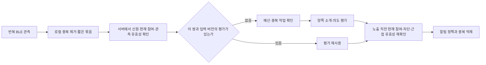

# 직접 끌 때까지 BLE 발견을 허용할 때의 비용과 제약

조사일: 2026-09-19. 상태: **공식 자료·연구 검토와 설계 제안. 실기기 측정 미실시.** 사용자 결정 B1은 이번 MVP의 BLE 핵심 흐름, B3은 인터넷 필요이다. 조사 후 B2는 지속 ON으로 확정했으며, 사용자는 배터리 최적화·장시간 성능 논의를 해커톤 이후로 미뤘다. 이 문서의 장시간 측정과 배터리 예산 제안은 이번 완료 조건이 아니다. 현재 결정 원본은 [제품 전환 기록](../../docs/product-direction.md)이다. **2026-09-20 B13/B14 이후 제품은 별도 수락 없는 바로 채팅이며 시연 데이터도 동일하게 취급한다. 아래 공개·첫 연락 정책 관련 연구 제안은 현행 제품 결정보다 우선하지 않는다.**

조사 후 사용자 결정: **B4는 몇 분 이상 함께 머무는 상대 중심, B5는 Android 간 검증부터 시작**하는 추천안을 채택했다. 아래 iOS 비교는 선택 근거와 후속 검증 참고 자료이며 이번 필수 지원 범위가 아니다. B4/B5 이후 별도로 B2의 지속 ON을 채택했다. 제안 성능 수치를 채택하거나 실측한 것은 아니다.

## 판단

직접 끌 때까지 발견 참여를 허용하는 정책을 배터리 문제만으로 배제할 근거는 없다. 그러나 지속 ON을 높은 강도의 연속 스캔, 매 감지 서버 호출, 매 호출 LLM 평가로 구현하면 비용이 커진다. 참여 의사 유지, 무선 탐색 강도, 서버 갱신, 의미 평가, 사용자 알림을 독립적으로 제어해야 한다.

사용 가능한 배터리 수준으로 낮췄을 때도 원하는 사람을 제때 발견하는지가 핵심이다. 기기·OS·밀집도·통신 조건에 따른 **추가 에너지와 발견 성공률·지연의 동시 측정** 없이는 ‘하루 몇 % 소모’나 ‘항상 즉시 발견’을 약속할 수 없다. 특히 잠깐 스쳐 가는 만남과 몇 분 함께 머무는 만남은 허용 가능한 탐색 정책이 다르다.

## 1. 비용을 분리해서 본다

| 단계 | 비용과 실패 요인 | 설계 제안 |
| --- | --- | --- |
| 발견 참여 의사 유지 | 설정 자체와 실제 실행은 다름. 예전 교류 의도가 계속 남을 수 있음 | 참여 설정과 실제 작동·의도 유효성을 분리 |
| BLE 광고 | 광고 빈도·payload·기기 역할·밀집 충돌 | 식별에 필요한 최소 데이터, 플랫폼별 광고 검증 |
| BLE 스캔 | 수신 duty cycle, 필터, OS 제한 | 서비스 필터와 OS 저전력 API, 전경 탐색과 배경 탐색 구분 |
| 앱 처리 | 중복 콜백·파싱·로그·타이머·wake lock | 로컬 중복 제거, 변경 없는 RSSI에 고비용 작업 금지 |
| 신원 확인 | GATT 연결·재연결, 임시 ID 해석 | 플랫폼에 맞는 최소 교환; 모든 상대와 연결 유지하지 않음 |
| 인터넷 통신 | Wi-Fi/셀룰러 활성화, 약한 신호, 재시도 | 짧은 유효 관측 묶음, 연결 재사용, 상한 있는 재시도 |
| 서버 작업 | 반복 관측·쌍별 평가·캐시·로그/보관 | 중복 합치기, 요청 상한, 큐·캐시·삭제 정책 |
| LLM | 새 후보·입력 변경·모델 변경에 따른 토큰, 지연, 실패 | 의미 입력 버전별 평가 재사용, 신규·변경 후보만 평가 |
| 알림·화면 | 중복 푸시·진동·화면 사용 및 주의력 소모 | 같은 상대 중복 알림 억제, 끄기·차단을 서버가 받으면 새 노출 차단 |

실제 어느 항목이 가장 큰지는 측정 전에는 단정하지 않는다. 작은 비콘의 송신 전력과 휴대폰의 송신+수신+CPU+모바일 통신 비용을 동일시하지 않는다.

## 2. Android: 지속 동의와 최고 강도 스캔은 다르다

`ScanSettings`는 저전력·균형·저지연 모드를 구분한다. 저전력 모드는 기본이며 백그라운드에 적용되고, 가장 높은 duty cycle의 저지연 모드는 전경 사용을 권장한다. 정확한 스캔 간격을 모든 기기에서 같은 값으로 약속하지 않는다. [Android ScanSettings](https://developer.android.com/reference/android/bluetooth/le/ScanSettings)

백그라운드 안내는 필터에 맞는 기기가 발견되면 `PendingIntent`로 앱을 깨우는 방법을 설명한다. 주변 기기가 없어도 앱을 깨우는 정기 스캔 예약은 비효율적이라 권장하지 않는다. 따라서 ‘30초마다 앱을 깨워 스캔’ 같은 임의 타이머를 저전력 해법으로 선결정하지 않는다. [백그라운드 BLE](https://developer.android.com/develop/connectivity/bluetooth/ble/background)

무필터 스캔은 화면이 꺼지면 중단될 수 있으며 문서는 적절한 필터 사용을 안내한다. 스캔 지원이 곧 상대 휴대폰의 광고 지속성까지 보장하는 것은 아니다. [BluetoothLeScanner](https://developer.android.com/reference/android/bluetooth/le/BluetoothLeScanner)

Doze에서는 CPU·네트워크 접근과 작업 실행에 제약이 있다. BLE 이벤트를 받았어도 서버 추천이 곧바로 도착한다고 가정하지 않는다. 앱별 상시 수신 소켓 대신 공유 푸시 연결을 사용하는 방향이 적절하며, foreground service와 wake lock을 무조건 유지하는 접근은 피한다. 서비스 유형·시작 조건도 확인해야 한다. [Doze 안내](https://developer.android.com/training/monitoring-device-state/doze-standby), [Foreground service 유형](https://developer.android.com/develop/background-work/services/fgs/service-types)

## 3. iOS: 배터리 외에 잠금 상태와 기기 간 발견이 중요하다

Core Bluetooth의 일반 백그라운드 동작은 중복 발견을 합치고 탐색·광고 주기를 늘릴 수 있다. 동일 상대의 매 광고를 앱이 계속 받는다고 전제할 수 없으므로, 콜백이 끊겼다는 이유만으로 즉시 상대가 떠났다고 판단해서도 안 된다. [일반 백그라운드 처리](https://developer.apple.com/library/archive/documentation/NetworkingInternetWeb/Conceptual/CoreBluetooth_concepts/CoreBluetoothBackgroundProcessingForIOSApps/PerformingTasksWhileYourAppIsInTheBackground.html)

iOS 26은 Live Activity와 함께 일부 전경 수준의 Bluetooth 권한을 제공한다. 그러나 2026년 2월 **Apple 엔지니어의 공식 포럼 설명**에 따르면 잠금 상태에서 화면까지 꺼지면 특정 UUID 스캔·중복 병합 등 제약이 다시 적용된다. 이는 탐색 자체가 전부 불가능하다는 뜻이 아니라, 전경과 동일한 품질을 유지할 수 없다는 뜻이다. API 문서와 포럼 해설의 출처 수준은 구분한다. [현행 Core Bluetooth](https://developer.apple.com/documentation/corebluetooth), [화면 꺼짐에 관한 엔지니어 설명](https://developer.apple.com/forums/thread/815189)

Live Activity는 최대 8시간 활성 상태이며 종료 후 잠금 화면에 최대 4시간 남는 것은 활성 시간 연장이 아니다. 무기한 발견을 유지하는 수단으로 간주하지 않는다. [ActivityKit](https://developer.apple.com/documentation/activitykit/displaying-live-data-with-live-activities)

현재 광고 API 설명은 백그라운드에서 local name을 제외하고 서비스 UUID를 iOS의 명시적 스캔으로만 발견 가능한 overflow 영역에 넣는다고 명시한다. Live Activity의 스캔 권한 확대가 이 광고 제약까지 제거한다는 근거는 확인하지 못했다. 따라서 Android가 잠긴 iPhone의 광고를 일반적인 방식으로 발견한다고 전제하지 않는다. [startAdvertising](https://developer.apple.com/documentation/corebluetooth/cbperipheralmanager/startadvertising%28_%3A%29)

**설계 추론:** iPhone이 Android 광고를 발견하고 서버가 양쪽에 반영하는 비대칭 구조를 검토할 수 있다. 이는 교차 OS 발견 문제의 해결 완료를 뜻하지 않는다. 잠금 상태의 발견 지연·신원 교환·통신·잘못된 관측 신고를 실기기로 검증해야 한다.

OS에 의한 종료와 사용자의 강제 종료도 다르다. 일반 앱의 강제 종료 뒤 자동 복원을 약속하지 않는다. 액세서리 설정을 위한 일부 예외를 주변 낯선 사람 발견 서비스에 그대로 적용할 수 있다고 가정하지 않는다. [TN3115](https://developer.apple.com/documentation/technotes/tn3115-bluetooth-state-restoration-app-relaunch-rules)

## 4. LLM 호출은 BLE 관측 횟수와 분리한다

아래는 특정 모델·벤더를 채택한 구현 명세가 아니라 비용을 통제하기 위한 설계 제안이다. 기존 두 자유 입력, 양쪽 의도 고려, AI 담당의 평가 방식 선택, Promptfoo 결정은 유지한다.

### 새 호출이 필요한 것과 필요하지 않은 것

| 사건 | LLM 재평가 필요성 |
| --- | --- |
| 같은 상대 광고를 다시 받음 | 없음. 관측 신선도만 관리 |
| RSSI가 조금 달라짐 | 의미 입력이 같다면 없음. 근접 판정과 의미 평가 분리 |
| 개인정보 보호용 임시 ID가 회전 | 서버에서 같은 사용자로 해석되면 의미 평가는 재사용 |
| 처음 만난 후보에 유효 평가가 없음 | 예산 내에서 평가 |
| 본인/상대 소개 또는 교류 의도 변경 | 해당 버전의 평가 갱신 |
| 모델·프롬프트·평가 정책 변경 | 호환되지 않는 캐시만 무효화; 전체 즉시 재평가는 피함 |
| 끄기·차단·권한 만료 | LLM 없이 정책에 반영. 원격 노출 중단은 서버의 변경 수신 시점과 구분 |
| 사용자가 이전 의도를 그대로 둔 채 하루가 지남 | 단순 재호출로 실제 의도 변화를 알아낼 수 없음. 의도 유효성 정책이 필요 |

평가 캐시는 서버 내부 사용자 식별자, 양쪽 소개·의도 버전, 평가 정책/모델 버전, 필요한 경우 조회 방향을 포함해야 한다. A에게 보여줄 이유와 B에게 보여줄 이유는 다를 수 있다. BLE 임시 ID 자체를 영구 캐시 식별자로 쓰면 회전 때마다 불필요한 재평가가 생긴다. 캐시 보관·삭제는 개인정보 수명 정책과 함께 정하며 무기한 저장을 뜻하지 않는다.

**추천 적합도 캐시와 현재 노출 권한은 별개다.** 예전 평가가 남아 있어도 끈 사람이나 차단한 사람을 다시 노출하지 않는다. LLM 처리 중 입력·참여가 바뀌면 오래된 결과로 알림을 보내지 않는다.

### 밀집 공간의 규모 계산

실측이 아닌 비교 예시: 100명이 모두 서로 후보이고, 소개·의도가 바뀌지 않는 상태로 8시간 머문다고 가정한다.

- 모든 방향의 쌍을 매분 평가하면 `100 × 99 × 480 = 4,752,000`개의 방향별 평가가 필요하다.
- 입력 버전당 한 번만 평가하면 방향별로 최대 `100 × 99 = 9,900`개다.
- 한 작업이 두 방향의 결과를 모두 산출하도록 설계하면 쌍별 `100 × 99 / 2 = 4,950`개로 묶을 수 있다. 양쪽 평가의 품질·출력 분리 검증은 필요하다.

이는 의미 평가 작업 수이며 API 요청 수·토큰 비용과 일치하지 않을 수 있다. 후보를 묶어 한 번에 보내면 요청 수는 줄어도 토큰은 남는다. 캐시도 **첫 만남의 O(N²) 비용**을 없애지 않으므로 행사처럼 동시에 신규 후보가 많으면 별도의 호출 예산·큐·평가 우선순위가 필요하다.

비용 계산은 `입력 토큰 × 입력 단가 + 출력 토큰 × 출력 단가`에 캐시 읽기/쓰기·재시도·전처리/임베딩 비용을 해당 제공자의 실제 청구 방식대로 더한다. 모델·트래픽·입력 길이가 미정이므로 현재 비용을 달러/원으로 확정하지 않는다. 서비스 응답 캐시와 LLM 제공자의 프롬프트 캐시는 다르다. 후자는 요청·추론 전체를 없애는 수단이 아니다.

후보 제한 또는 임베딩 전처리를 도입한다면 유사한 사람뿐 아니라 도움을 요청하는 사람과 제공하는 사람처럼 상보적인 의도를 놓치지 않는지 평가한다. 비용 절감을 이유로 기존의 양쪽 의도 고려를 키워드 일치로 대체하지 않는다. 미평가와 부적합을 구분하며 임의로 긍정적 추천 이유를 만들지 않는다.

### 휴대폰 배터리와 서버 비용의 관계

서버 LLM을 쓰는 구성이라면 추론 연산 자체는 서버에서 발생한다. 휴대폰은 요청·응답 통신, 앱 처리, 알림 등의 비용을 부담한다. 따라서 ‘계속 ON = 휴대폰에서 LLM이 계속 실행됨’은 아니다. 온디바이스 LLM 채택은 별도 선택이며 이번 인터넷 필요 결정에 포함되지 않는다.

호출 전 중복 작업을 합치고, 사용자별·전역 예산과 동시 실행 상한을 둔다. 과부하에서는 기존 유효 평가를 재사용하거나 평가 대기 상태를 보여주며, 발견 이벤트가 다시 올 때마다 실패한 LLM 요청을 무제한 재시도하지 않는다. 가짜 기기·위조 관측이 고비용 평가를 무제한 유발하지 않도록 유효성 확인을 비용 큰 단계 앞에 둔다. 구체적인 인증·관측 검증 방식은 플랫폼 결정 후 설계한다.

## 5. 네트워크·알림·정보 신선도

Android는 모바일 통신이 주요 배터리 비용이 될 수 있으며, 짧은 전송을 자주 하기보다 묶고 연결을 재사용하도록 안내한다. BLE 패킷마다 인터넷 요청을 하지 않는 근거다. 다만 묶음 대기 시간만큼 발견→알림이 늦어지므로, 배터리 최적화 수치만 보고 정책을 고르면 안 된다. [네트워크 최적화](https://developer.android.com/develop/connectivity/network-ops/network-access-optimization)

Android FCM의 일반 우선순위는 Doze에서 늦어질 수 있다. 높은 우선순위는 시간에 민감하고 사용자에게 보이는 알림을 위한 것이며, 일반 동기화 작업을 계속 깨우는 우회로로 쓰지 않는다. 푸시 도착까지 포함해 실제 알림 지연을 측정한다. [FCM 메시지 우선순위](https://firebase.google.com/docs/cloud-messaging/android-message-priority)

관측 직후 LLM을 호출해도 응답 시점에 상대가 떠났을 수 있다. 발견 시각, 업로드 시각, 평가 완료 시각, 알림 수신 시각을 구분한다. 오래된 결과를 현재 근처에 있다는 확정 표현으로 노출하지 않는다. OS의 중복 병합으로 관측이 없을 수도 있으므로 마지막 관측만으로 즉시 이탈을 확정하지 않는 정책이 필요하다.

참여 설정을 무기한 유지하는 것과 상대에게 공개할 의도를 무기한 유효하게 보는 것은 다른 문제다. 어제의 ‘오늘 점심 같이 먹기’가 오늘도 남으면, 배터리와 LLM 캐시가 완벽해도 잘못된 추천이 된다. 의도 수정·유효성·알림 휴식 정책은 제품 결정 대상이다. 끄기와 네트워크 단절이 동시에 발생한 경우 서버 반영 지연도 고려해야 한다.

## 6. 추천하는 검증 방향

지속 ON의 제품 정책은 B2에서 채택했다. 아래 세부 최적화 구성은 **기술 제안**이며, 장시간 성능 평가는 해커톤 이후다.

- 발견 참여 의사는 사용자가 직접 끌 때까지 유지한다(B2 확정).
- 배경에서는 OS가 지원하는 서비스 필터·저전력 발견을 사용하고, 사용자가 ‘지금 찾기’를 열면 짧은 적극 탐색을 제공하는 안을 비교한다.
- 광고·신원 확인에 필요한 최소 BLE 교환 후 의미 평가·채팅은 서버에서 수행하는 구성을 우선 검토한다. 기존 GATT 채팅 프로토콜은 자동 채택하지 않는다.
- 참여 ON과 실제 탐색 작동 상태를 분리해 보여준다. Bluetooth OFF·권한 취소·강제 종료·OS 제한을 ‘현재 탐지 중’으로 표현하지 않는다.
- 저전력 모드·배터리 부족 때 탐색을 낮추거나 중지하는 정책을 검토한다. 사용자가 끄지 않아도 기능 품질이 달라질 수 있음을 제품 약속에 반영한다.
- 사람이 없는 때의 배터리, 새 사람이 많은 때의 LLM 비용, 반복해서 같은 사람이 있는 때의 중복 억제를 별도로 검증한다.

단순한 스캔 시간 상한이 곧 정답은 아니다. 짧게 켜더라도 최고 강도 스캔과 중복 서버 호출을 반복하면 비효율적이고, 계속 켜더라도 OS 필터와 변경 기반 처리가 적합하면 검증할 가치가 있다. 다만 이 원리가 실제 기기에서 충분한 발견률로 구현되는지는 미확인이다.

## 7. 실기기 검증 계획

필수 지원 범위는 B5에 따라 Android 사용자 간이다. 아래 Android↔Android를 이번 필수 검증으로 두고 iPhone 관련 조합은 후속 검증으로 구분한다. 제조사·모델·OS 버전의 구체 목록은 구현 구성에 맞춰 정한다. 현재는 준비할 측정 계획이며 테스트 실행을 주장하지 않는다.

| 축 | 비교 조건 |
| --- | --- |
| 비용 분리 | OFF 기준 / 광고만 / 광고+스캔 / 서버 업로드 포함 / 추천·알림 포함 |
| 단말 | Android↔Android, iPhone↔iPhone, 교차 OS; 대표 제조사·OS 버전 기록 |
| 실행 | 전경, 다른 앱 사용, 잠금 화면 표시, 화면 꺼짐, 절전·Doze, OS 종료, 사용자 강제 종료, 재부팅 |
| 환경 | 후보 없음 / 소수 / 밀집, 정지 / 이동 / 짧은 스침, 가방·주머니 |
| 통신 | Wi-Fi / 셀룰러, 약한 신호, 끊김·재연결, Bluetooth·권한 변경 |
| 의미 입력 | 같은 후보 반복 / 신규 유입 / 소개·의도 수정 / 임시 ID 회전 / 차단·끄기 |

1. **먼저 기능 확인:** 선택한 OS 조합에서 실제 화면 꺼짐 상태의 광고·발견·신원 확인·서버 반영이 성립하는지 확인한다. 전경 두 대 시연 성공을 배경 성공으로 일반화하지 않는다.
2. **원인 분리:** 짧은 반복 구간에서 위 비용 단계를 비교해 무선/CPU/네트워크 병목을 찾는다.
3. **긴 사용 확인:** 같은 단말에서 조건을 통제해 최소 8시간 OFF 대비 ON 추가 소비를 반복 비교한다. 하루 사용 약속 전에는 더 긴 관찰도 필요하다. 실행 순서를 바꾸고 시작 배터리·온도·화면·백그라운드 앱·신호·배터리 건강을 기록한다.
4. **성능을 함께 기록:** 발견 성공률, p50/p95 발견→서버→알림 지연, 놓친 짧은 만남, 실제 탐색 가능 시간, 중복 이벤트, 업로드 수/bytes, LLM 평가 수/토큰/비용·캐시 적중률, 중복·늦은 알림 수를 수집한다. 성공한 경우만 지연 통계에 넣고 실패를 숨기지 않는다.

배터리 지표는 앱의 ‘전체 사용량 중 점유율’과 총 배터리의 ‘추가 감소 %p’를 구분한다. 가능하면 에너지 Wh와 평균 추가 전력 mW도 측정한다. 단순 환산식은 `추가 소모 %p = 추가 평균 전력(W) × 시간(h) / 사용 가능한 배터리 용량(Wh) × 100`이다. 특정 mW나 %p를 현재 앱의 실측값으로 제시하지 않는다.

검토할 초기 목표 예시: 화면 OFF 혼합 사용 8시간에 OFF 대비 추가 소모 3%p 이하. 이는 **팀과 아직 합의하지 않은 제품 예산 제안**이며 예상 실측값·보편적 합격 기준이 아니다. 수용할 발견 지연·성공률과 반드시 함께 정해야 한다.

Android Power Profiler의 전력 rail 측정은 지원 단말에 제한이 있으므로 지원 여부를 확인한다. iOS 26 Power Profiler는 전체 시스템과 앱별 원인을 비교할 수 있지만 디버거 연결이 휴면 상태에 영향을 줄 수 있다. 일상 조건 측정은 충전·디버거 영향을 피하고 같은 기기의 반복 측정으로 비교한다. [Android Power Profiler](https://developer.android.com/studio/profile/power-profiler), [Apple Power Profiler](https://developer.apple.com/documentation/xcode/measuring-your-app-s-power-use-with-power-profiler)

## 8. 과거 정량 연구의 해석

2020년 스마트폰 근접 탐지 연구는 특정 기기·설정에서 광고보다 수신에 더 큰 비용을 관찰했다. 2015년 스마트폰 BLE 연구도 스캔 간격·duty cycle의 중요성을 보고했다. 이 결과는 병목을 나누어 측정해야 하는 근거이며, 구형 단말·특정 실험을 현재 스마트폰의 하루 배터리 감소율로 환산하지 않는다. 두 연구 모두 이번 서비스의 서버·LLM·알림 전체를 측정한 결과가 아니다. [2020년 근접 패턴 연구](https://onlinelibrary.wiley.com/doi/10.1155/2020/8506323), [2015년 스마트폰 BLE 연구](https://ink.library.smu.edu.sg/sis_research/3119/)

## 9. 조사 후 결정한 조건과 남은 질문

- **B4 확정:** 몇 분 이상 같은 공간에 머무는 상대 중심으로 검증한다.
- **B5 확정:** Android 사용자 간 검증부터 시작하고 iPhone·교차 OS는 후속 단계로 둔다.

후속 B2에서 직접 끌 때까지 참여를 유지하기로 확정했다. 사용자가 배터리 최적화·장시간 성능 논의를 해커톤 이후로 미뤘으므로 이 조사 결과를 근거로 동일한 선택이나 배터리 예산을 다시 묻지 않는다. 실제 BLE 발견과 소개할 시연 동작은 검증하며, 장시간 작동·소모량은 실측 없이 보장하지 않는다.
