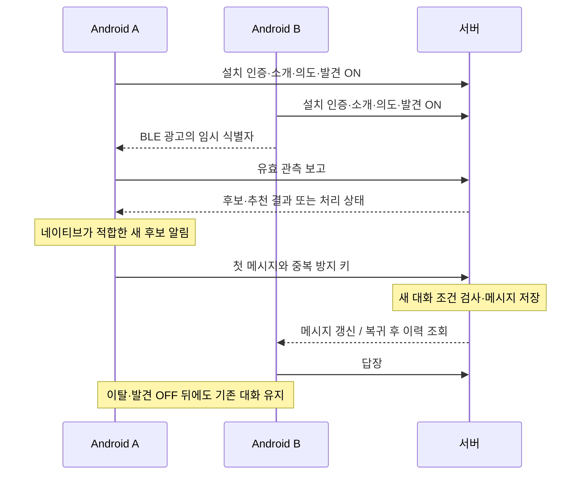

# 발견·추천·채팅 프로토콜

원본은 [API 계약](../docs/api-contract.md)과 [개발 기준](../docs/development-contract.md)이다. 이 문서는 전송 계층의 책임을 요약하며 이전 행사/GATT 메시지 프로토콜은 [이력](../docs/history/event-mvp/spec/protocol.md)에 보존한다.

BLE 식별자는 인증 토큰이나 공개 프로필이 아니다. 광고 바이트·서비스 UUID·임시 ID 회전은 Android API 예산 내에서 구현하며 구형 초안을 복사하지 않는다. Android는 스캔과 광고 지원을 실기기에서 확인한다.

프로필·추천·채팅은 인터넷 서버로 처리한다. 첫 메시지 저장 전에는 현재 발견·참여를 확인하고, 기존 대화에는 근접성을 다시 요구하지 않는다. 서버 저장·순번·중복 방지가 전달의 기준이다. 연결 종료는 이력 삭제가 아니다.

백그라운드 경로는 Kotlin이 BLE 보고와 서버 응답·결과 조회·시스템 알림까지 담당한다. UI용 실시간 연결은 복귀 시 이력 조회로 보완한다. 서버 평가가 비동기인 경우 네이티브의 제한된 결과 조회 또는 FCM 등 전달 경로를 구현 시 고정한다. FCM·SSE·WebSocket을 쓴다는 이유만으로 잠금 상태의 동작을 검증했다고 하지 않는다.
